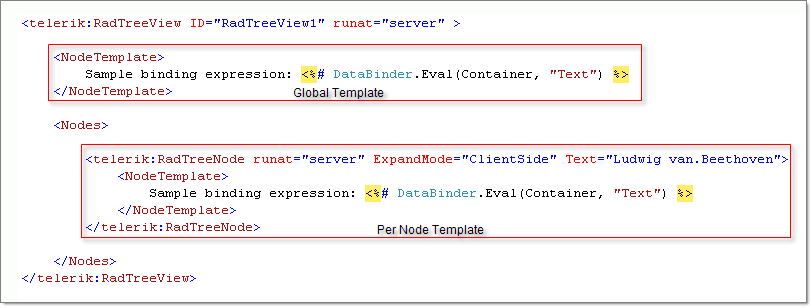
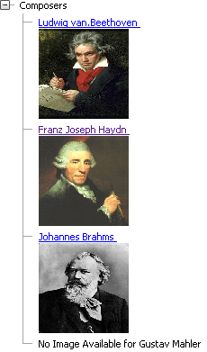

# ASPX Template Structure


## 

You can define two types of Telerik RadTreeView templates:

1. __Global (RadTreeView Node Template)__ Templates are applied to all tree Nodes automatically;

1. __Per-Node (Node Template)__ Templates override global Templates.


>caption 



>note  __DataBinder.Eval__ expressions work only when the TreeView is in a bound mode. In other words, you should explicitly call the __DataBind()__ method even if no datasource is set to the TreeView.
>


The following demonstrates how multiple elements are placed into a Template and DataBinder expressions are used to populate the links. The example also shows how Per-Node Templates interact with the global Templates. The example produces the TreeView screenshot shown below. A global Template defines the "No Image Available" message for Nodes without Templates.


>caption 



````ASPNET
	    <telerik:RadTreeView ID="RadTreeView1" runat="server" LoadingStatusPosition="BeforeNodeText">
	        <NodeTemplate>
	            No Image Available for
	            <%# DataBinder.Eval(Container, "Text") %><br />
	        </NodeTemplate>
	        <Nodes>
	            <telerik:RadTreeNode runat="server" ExpandMode="ClientSide" Text="Composers">
	                <NodeTemplate>
	                    <%# DataBinder.Eval(Container, "Text") %></NodeTemplate>
	                <Nodes>
	                    <telerik:RadTreeNode runat="server" ExpandMode="ClientSide" Text="Ludwig van.Beethoven">
	                        <NodeTemplate>
	                            <a href="http://en.wikipedia.org/wiki/Ludwig_van_Beethoven">
	                                <%# DataBinder.Eval(Container, "Text") %>
	                            </a>
	                            <br />
	                            
	                        </NodeTemplate>
	                    </telerik:RadTreeNode>
	                    <telerik:RadTreeNode runat="server" ExpandMode="ClientSide" Text="Franz Joseph Haydn">
	                        <NodeTemplate>
	                            <a href="http://en.wikipedia.org/wiki/Joseph_Haydn">
	                                <%# DataBinder.Eval(Container, "Text") %>
	                            </a>
	                            <br />
	                            
	                        </NodeTemplate>
	                    </telerik:RadTreeNode>
	                    <telerik:RadTreeNode runat="server" ExpandMode="ClientSide" Text="Johannes Brahms">
	                        <NodeTemplate>
	                            <a href="http://en.wikipedia.org/wiki/Johannes_Brahms">
	                                <%# DataBinder.Eval(Container, "Text") %>
	                            </a>
	                            <br />
	                            
	                        </NodeTemplate>
	                    </telerik:RadTreeNode>
	                    <telerik:RadTreeNode runat="server" ExpandMode="ClientSide" Text="Gustav Mahler">
	                    </telerik:RadTreeNode>
	                </Nodes>
	            </telerik:RadTreeNode>
	        </Nodes>
	    </telerik:RadTreeView>
````


