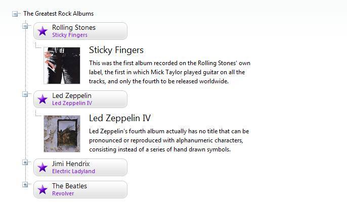

# Templates Overview

Templates allow you to embed any context inside a **RadTreeNode**. For example:

* HTML markup

* ASP.NET server controls

* other third-party controls (other Telerik RadControls for ASP.NET as well)

## When to use Templates

Normally, **RadTreeView** allows great flexibility with regard to the functionality and appearance of your tree Nodes. Use Templates to embed complex elements (such as ASP .NET controls) inside your tree Nodes. Templates are also a great way to avoid setting too many properties to each tree Node explicitly. The example below shows images and additional text embedded in a tree Node Template:

>caption 

**See** live example at: [RadTreeView Templates](https://demos.telerik.com/aspnet-ajax/TreeView/Examples/Functionality/Templates/DefaultCS.aspx)
