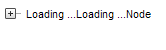

# Double Loading Message When You Expand Node Fast


## 

If you have a node that loads its child nodes on demand you might get the Loading... message shown twice if you click very fast on the plus sign to expand the node or the server responds slowly:


>caption 



To overcome the problem you need to subscribe to the [OnClientNodeExpanding]() and [OnClientNodePopulated]() client events and define the event handlers as follows:


````JavaScript
var flag;
function OnClientNodeExpandingHandler(sender, e)
{
   var node = e.get_node();
   if (node.get_expandMode() > 0)
   {
       if (flag == 1)
       {
           e.set_cancel(true);
       }    
       else
       {
           flag = 1;
       }
   }
}
function OnClientNodePopulatedHandler(sender, e)
{
   flag = 0;
}		
````


