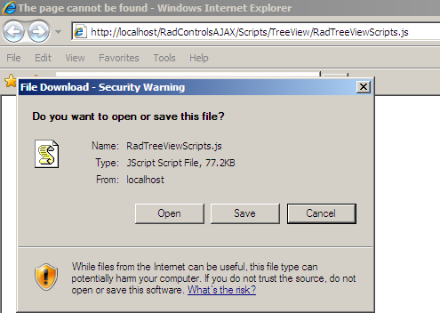

# Telerik.Web.UI.RadTreeView Is null or not an object


## Symptoms


>caption 


## Causes and Solutions

Telerik **RadTreeView** cannot find its JavaScript code. The necessary code is fetched either from the **WebResource.axd** file or from files located in the project's folder, depending on the control's settings.

## Case 1: EnableEmbeddedScripts property of Telerik RadTreeView is set to false:

* The control's scripts are not referenced - first, copy the needed script files from the installation directory of RadControls for ASP.NET AJAX in the project's directory; then reference them from the **ScriptManager** like this:

````ASPNET
<asp:ScriptManager ID="ScriptManager1" runat="server">
    <Scripts>
        <asp:ScriptReference Path="~/Scripts/Common/Core.js" />
        <asp:ScriptReference Path="~/Scripts/Common/Animation/AnimationScripts.js" />
        <asp:ScriptReference Path="~/Scripts/Common/Navigation/NavigationScripts.js" />
        <asp:ScriptReference Path="~/Scripts/TreeView/RadTreeViewScripts.js" />
    </Scripts>
</asp:ScriptManager>
````


* The control's scripts are referenced but the error still shows which means the **RadTreeViewScripts.js** file is not physically in the location specified by the **Path** property or the file is inaccessible.To make sure that this is really the case, you can copy the path to the **RadTreeViewScripts.js** file for example in the browser and see if you have access to this file. If you cannot retrieve this file you will see the following error message:


>caption 


>caption 


The solution is to make sure that the file is intact, and it is in the location specified by the **Path** property of the **ScriptManager**. If the file is accessible you will be able to view it or download it:


>caption 



## Case 2: EnableEmbeddedScripts property of Telerik RadTreeView is set to true (Default case)

In this case **RadTreeView** will search for its JavaScript code embedded in the **WebResource.axd** and **ScriptResource.axd** as part of the **DLL** of the control's suite.

The following articles discuss possible causes and solutions of the problem:

* [Getting CryptographicException exception "Padding is invalid and cannot be removed" after Migrating to ASP.NET 2.0](http://blogs.msdn.com/paraga/archive/2006/07/03/655081.aspx)

* [How To: Configure MachineKey in ASP.NET 2.0](http://msdn2.microsoft.com/en-us/library/ms998288.aspx)
