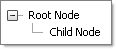

# Rendering


## 

RadTreeView renders DIV tags which produces a smaller page size, which is quicker to load and easy to style. For example, consider the following RadTreeView declaration that produces the screen shot below:




````ASPNET
	    <telerik:RadTreeView ID="RadTreeView1" runat="server" LoadingStatusPosition="BeforeNodeText">
	        <Nodes>
	            <telerik:RadTreeNode runat="server" Text="Root Node" ExpandMode="ClientSide">
	                <Nodes>
	                    <telerik:RadTreeNode runat="server" Text="Child Node" ExpandMode="ClientSide">
	                    </telerik:RadTreeNode>
	                </Nodes>
	            </telerik:RadTreeNode>
	        </Nodes>
	    </telerik:RadTreeView>
````


The rendered output for this TreeView is as follows:

````HTML
	    <div id="Div1" class="radtreeview RadTreeView_Default ">
	        <ul class="rtUL rtLines">
	            <li class="rtLI rtFirst rtLast">
	                <div class="rtTop">
	                    <span class="rtSp"></span><span class="rtPlus"></span><span class="rtIn">Root Node</span>
	                </div>
	                <ul class="rtUL" style="display: none;">
	                    <li class="rtLI rtLast">
	                        <div class="rtBot">
	                            <span class="rtSp"></span><span class="rtIn">Child Node</span>
	                        </div>
	                    </li>
	                </ul>
	            </li>
	        </ul>
	        <input id="RadTreeView1_ClientState" name="RadTreeView1_ClientState" type="hidden" /></div>
````


