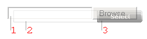

# File Input Appearance


>caution  **RadUpload** has been replaced by [RadAsyncUpload](http://demos.telerik.com/aspnet-ajax/asyncupload/examples/overview/defaultcs.aspx), Telerik’s next-generation ASP.NET upload component. If you are considering Telerik’s Upload control for new development, check out the [documentation of RadAsyncUpload ](http://www.telerik.com/help/aspnet-ajax/asyncupload-overview.html) or the [control’s product page](http://www.telerik.com/products/aspnet-ajax/asyncupload.aspx). If you are already using **RadUpload** in your projects, you may be interested in reading how easy the transition to RadAsyncUpload is and how you can benefit from it [in this blog post](http://blogs.telerik.com/blogs/12-12-05/the-case-of-telerik-s-new-old-asp.net-ajax-upload-control-radasyncupload). The official support for **RadUpload** has been discontinued in June 2013 (Q2’13), although it is still be available in the suite. We deeply believe that **RadAsyncUpload** can better serve your upload needs and we kindly ask you to transition to it to make sure you take advantage of its support and the new features we constantly add to it.
>


**RadUpload** is built over the standard **`<input type=file>`** (File Input) element. This html element is very limited in functionality, and one of its largest limitations lies in its inability to change its visual appearance. A very small number of CSS styles can be applied to file inputs and they are different between different browsers.

The following image illustrates how **RadUpload** works around the limitations of the file input element:



* A **TextBox** (marked as 2 in the image below) and a **Button**(3) are placed below a transparent File Input (1). When the user clicks with the mouse on the Button, or types text in the TextBox, the File Input receives the mouse and keyboard events because it is on top of the other controls.

* Using javascript, these events are set to the visible **TextBox** and **Button** in order to synchronize their content and appearance.

>note The html elements in the image above are offset a bit for clarity.
>


The **EnableFileInputSkinning** property controls whether the **TextBox** and **Button** are used to affect the appearance of the file input element:

* When **EnableFileInputSkinning** is **true**, **RadUpload** displays the controls as described above. The File Input has the **input.ruFileInput** CSS class applied, the TextBox has **input.ruFakeInput**, and the Button has two CSS classes - **input.ruButton** and **input.ruBrowse**.

* When **EnableFileInputSkinning** is **false**, the TextBox and the Button aren't rendered, and the File Input is visible. In this mode the **ruStyled** CSS class from **span.ruFileWrap** is removed.

## Increasing File Input Width

**RadUpload**

**RadUpload**

* **InputSize** - set this property to an **integer** value to increase the width of all **file input elements**.

* **Width** - set this property in **pixels** to increase the width of the **whole RadUpload area** containing all elements such as buttons, file input fields, etc.

The two properties control the appearance of different **RadUpload** UI elements. Their manipulation should be synchronized so that a nice overall appearance is achieved at the end (e.g. under IE7 if only **InputSize** is set (to a value bigger than 70), the browse button is not vissible - make sure that the **Width** property is set too).

````ASPNET
<telerik:radupload id="Radupload1" runat="server" enablefileinputskinning="true"
    inputsize="50" width="475px" skin="Web20"></telerik:radupload>
````


# See Also

 * [CSS Skin File Selectors]()
