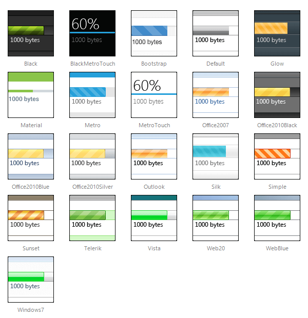

# Skins

>caution  **RadUpload** has been replaced by [RadAsyncUpload](https://demos.telerik.com/aspnet-ajax/asyncupload/examples/overview/defaultcs.aspx), Telerik’s next-generation ASP.NET upload component. If you are considering Telerik’s Upload control for new development, check out the [documentation of RadAsyncUpload ](https://www.telerik.com/help/aspnet-ajax/asyncupload-overview.html) or the [control’s product page](https://www.telerik.com/products/aspnet-ajax/asyncupload.aspx). If you are already using **RadUpload** in your projects, you may be interested in reading how easy the transition to RadAsyncUpload is and how you can benefit from it [in this blog post](https://blogs.telerik.com/blogs/12-12-05/the-case-of-telerik-s-new-old-asp.net-ajax-upload-control-radasyncupload). The official support for **RadUpload** has been discontinued in June 2013 (Q2’13), although it is still be available in the suite. We deeply believe that **RadAsyncUpload** can better serve your upload needs and we kindly ask you to transition to it to make sure you take advantage of its support and the new features we constantly add to it.
>

**RadUpload** and **RadProgressArea** use **skins** to control their overall look-and-feel. A skin is a set of images and a CSS stylesheet that can be applied to the control elements (items,images, etc.) and defines their look and feel. To apply a skin to a **RadUpload** or **RadProgressArea** control, set its **Skin** property, either using the property's pane or the control's [Smart Tag]().

**RadUpload** and **RadProgressArea** are installed with a number of preset skins:

 

 @[template - Material skin is available only in Lightweight mode](/_templates/common/skins-notes.md#material-only-in-lightweight) 

>note Since Q1 2013 three new skins have been added for RadUpload (BlackMetroTouch, Glow and Silk).
>

## Not using skins

If you do not set the **Skin** property, **RadUpload** and **RadProgressArea** automatically use the "Default" skin. If you do not want to use a skin with your control, set its **Skin** property to an empty string and set the **EnableEmbeddedSkins** property to **False**.

On **RadUpload**, you can also eliminate the skin from the file input area alone by setting the **EnableFileInputSkinning** property. For information about this property, see [File Input Appearance]().

## Customizing Skins

You can tweak the existing skins or create your own. Each skin has two main elements: images and a stylesheet. When creating your own,it is a good idea to start with the stylesheet for an existing skin and alter that. See [Tutorial:Creating a Custom Skin]() for a step-by-step walk through. To use your own skin

1. Add the new CSS file to your project.

1. Drag and drop the CSS file from the Project Explorer onto your Web page.

1. Set the **EnableEmbeddedSkins** property of the control to **False**.

The stylesheet for a **RadUpload** skin has the name **Upload.[SkinName].css** and can befound in the **...Skins/[SkinName]** directory. The images are found in the **...Skins/[SkinName]/Upload**directory. For example, the stylesheet for the "Black" skin is called Upload.Black.css and is located in the ...Skins/Black directory.The images are found in the ...Skins/Black/Upload directory. The images are referenced by name from within the stylesheet.

For more information on the CSS File structure, see [Understanding the Skin CSS File]().

## See Also

 * [Telerik ThemeBuilder for ASP.NET AJAX](https://themebuilder.telerik.com/)

