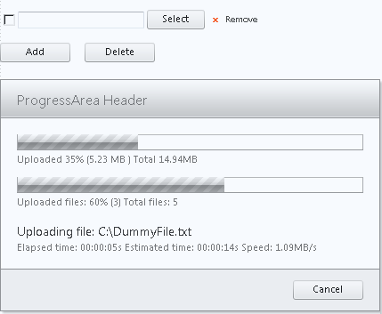
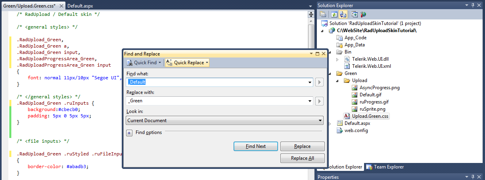
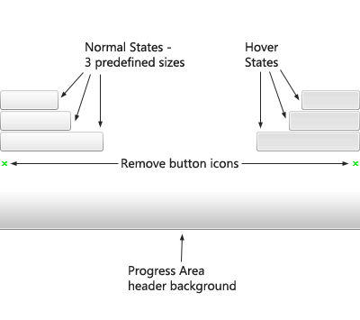

# Tutorial on Creating Custom Skin


>caution  **RadUpload** has been replaced by[RadAsyncUpload](http://demos.telerik.com/aspnet-ajax/asyncupload/examples/overview/defaultcs.aspx), Telerik’s next-generation ASP.NET upload component. If you are considering Telerik’s Upload control for new development, check out the[ documentation of RadAsyncUpload ](http://www.telerik.com/help/aspnet-ajax/asyncupload-overview.html)or the[control’s product page](http://www.telerik.com/products/aspnet-ajax/asyncupload.aspx). If you are already using **RadUpload** in your projects, you may be interested in reading how easy the transition to RadAsyncUpload is and how you can benefit from it[in this blog post](http://blogs.telerik.com/blogs/12-12-05/the-case-of-telerik-s-new-old-asp.net-ajax-upload-control-radasyncupload). The official support for **RadUpload** has been discontinued in June 2013 (Q2’13), although it is still be available in the suite. We deeply believe that **RadAsyncUpload** can better serve your upload needs and we kindly ask you to transition to it to make sure you take advantage of its support and the new features we constantly add to it.
>


The following tutorial demonstrates creating a custom **RadUpload** skin, using the default skin as a base. This new skin will take the appearance of **RadUpload** and **RadProgressDialog** from their default look:



to the following:


See [Understanding the Skin CSS File]() for more information on specific CSS file properties.

## Prepare the Project

1. In the Solution explorer, double-click the **Web.config** file to open it for editing:

1. Under the **<configuration>** element, locate the **<system.web>** element. Add it if it does not exist.

1. Under the **<system.web>** element locate the **<httpModules>** element. Add it if it does not exist.

1. In the **<httpModules>** element add the following tag to [register RadUploadHttpModule](FAFFEB65-66D2-4CFE-8F40-E4BA471540A9):

````XML
	    <add name="RadUploadModule" type="Telerik.Web.UI.RadUploadHttpModule, Telerik.Web.UI" />
````


1. Under the **<system.web>** element, locate the **<httpHandlers>** element. Add it if it does not exist.

1. In the **<httpHandlers>** element, add the following tag to [register RadUploadProgressHandler](FAFFEB65-66D2-4CFE-8F40-E4BA471540A9):

````XML
	    <add verb="*" path="Telerik.RadUploadProgressHandler.ashx" type="Telerik.Web.UI.RadUploadProgressHandler, Telerik.Web.UI" />
````


1. At this point, your Web.config should look as follows:

````XML
	    <configuration>
	    ...  
	        <system.web>    
	            <httpHandlers>      
	                <add verb="*" path="Telerik.RadUploadProgressHandler.ashx" type="Telerik.Web.UI.RadUploadProgressHandler, Telerik.Web.UI" />
	                      ...    
	            </httpHandlers>    
	            <httpModules>
	                <add name="RadUploadModule" type="Telerik.Web.UI.RadUploadHttpModule, Telerik.Web.UI" />
	                      ...    
	            </httpModules>
	                ...  
	        </system.web>
	    </configuration>
````


1. In the Solution Explorer, create a new "Green" directory in your project.

1. Copy the default **RadUpload** skin files from the installation directory to the "Green" directory; copy both the \Upload directory that contains the images for this skin and the Upload.Default.css file that defines the skin styles.

>note The file path will typically be similar to this example: *\Program Files\Telerik\<Your Version of RadControls for ASPNET>\Skins\Default.* 
>


1. In the Solution Explorer, rename "Upload.Default.css" to "Upload.Green.css". The Solution Explorer should now look something like the following:

1. Open Upload.Green.css and replace all instances of _Default with _Green. Then save the file:

1. Drag the "Upload.Green.Css" file from the Solution Explorer onto your Web page. This automatically adds a reference to the page "<head>" tag as a "<link>" to the new stylesheet:

1. Drag a **RadUpload** control from the toolbox onto your Web page.

* Set the **ControlObjectsVisibility** property to "All".

* Set the **EnableEmbeddedSkins** property to **False**.

* Change the **Skin** property to "Green".

1. Drag a **RadProgressManager** control from the toolbox onto your Web page.

1. Drag a **RadProgressArea** control from the toolbox onto your Web page.

* Set the **DisplayCancelButton** property to **True**.

* Set the **EnableEmbeddedSkins** property to **False**.

* Change the **Skin** property to "Green".

1. Drag a **Button** from the toolbox onto your Web page.

* Change its **Text** property to "Submit"

* Assign the following **Click** event handler, so that you can easily see the progress dialog:


````C#
	     
	    protected void Button1_Click1(object sender, EventArgs e)
	    {  
	        if (RadUpload1.UploadedFiles.Count > 0)  
	        {    
	            System.Threading.Thread.Sleep(3000);  
	        }
	    }
				
````
````VB.NET
	    Protected Sub Button1_Click(ByVal sender As Object, ByVal e As EventArgs) Handles Button1.Click
	        If RadUpload1.UploadedFiles.Count > 0 Then
	            System.Threading.Thread.Sleep(3000)
	        End If
	
	
	    End Sub
	
	
````


1. Run the application. Select a file and click the submit button. The new "Green" skin should look just like the default skin:

## Css classes for RadUpload

1. The skin CSS class that is applied to the <div> element which represents the rendered **RadUpload** control is **RadUpload_Green**. (This is also the class applied to the <div> element for **RadProgressArea**.) All other style definitions in the CSS files are qualified by this class. Within that top-level <div> element is an unordered list <ul> element, that handles the layout of the **RadUpload** control. This <ul> element has the **ruInputs** class applied. The default skin does not have a selector for the **ruInputs** class alone, which is why the default skin does not show the outlines of the entire **RadUpload** control. Add such a selector, giving it the following rules:

````ASPNET
	    .RadUpload_Green .ruInputs { 
	        background:#cbecb0; 
	        padding: 5px 0 5px 5px;
	    }
````


1. There are two ways of changing the appearance of the buttons and the input area.

1. One approach is to create a customized [CSS sprite](http://alistapart.com/articles/sprites) and apply it as a background image instead of the ruSprite.png located in Green\Upload folder. Thus, the effect of the rounded corners of the buttons can be preserved and one can choose any colors they need. Here is a brief explanation of the current Upload Sprite:

1. Another approach is to simply set the background to none, thus disable the customized sprite, and apply your own styles as decribed below:

1. The input area is actually a composite of a standard file input element sitting over a text box and button control that simulate a file input element. This is done so that the skin CSS file has more control over [styling the input area](). The **ruFakeInput** class is applied to the text box.Locate the rule for this element, and change the border color to "green" and the background to "#eeffee":

````ASPNET
	    div.RadUpload_Green .ruFakeInput { 
	          border:1px solid green;
	          color: #333;
	          background: #eeffee;
	    }
````


1. All of the buttons in the **RadUpload** control (and the **RadProgressArea** control, as well) have the **ruButton** class applied. Locate the selector for this class(.RadUpload_Green .ruButton,.RadUploadProgressArea_Green .ruButton), and add a green border, change the background from a url to "#88ff88", and change the color to "green":

````ASPNET
	    div.RadUpload_Green .ruButton,
	    div.RadUploadProgressArea_Green .ruButton{
	    
	    	background-image: none;
	    	width:68px;
	    	height:25px;
	    	border:solid 1px green;
	    	margin-left:0.8em;
	    	padding:0;
	    	background  : #88ff88;
	    	color: green;
	    	text-align:center;
	   }
	    
	    
````


1. Each button has an additional class applied that is specific to that type of button. These classes include **ruCheck**, **ruBrowse**, **ruRemove**, **ruAdd**, and **ruDelete**. The "Green" style sheet is not going to do anything special for different button types, so locate the selector for**.RadUpload_Green .ruRemove** and delete the class definition. However, if you need to change anything in that button, the text color, for instance, you could modify the class as follows:

````ASPNET
	    div.RadUpload_Green .ruRemove{
	    
		color: #000;
		}
````


1. The Add and Delete buttons appear inside a separate <li> element with the **ruActions** class applied. Therefore if you need to modify them you have to add the **div.RadUpload_Green .ruActions .ruButton** selector. In order to change the text color, the width and the margin, for example, add the following class definition:

````ASPNET
	    div.RadUpload_Green .ruActions .ruButton {
	    
	    width:115px;
	    margin:0 0.8em 0 0;
	    color: #000;
	    
	    }
````


1. Run the application. The RadUpload control has its new appearance. Select a file and click the submit button. Note that some of your changes affect the cancel button in the progress dialog as well:

## Css classes for RadProgressArea

1. Like the **RadUpload** control, **RadProgressArea** is laid out using a <div> element with the **RadUpload_Green** class applied, and within that by a <ul> element. In the case of **RadProgressArea**, however, the <ul> element has the **ruProgress** class applied instead of the **ruInputs** class. Locate the rule for this class, change the background color to "#efe", change the border to green, and reduce its width to 4px:

````ASPNET
	    .RadUpload_Green .ruProgress { border:4px solid Green; background:#efe; padding:15px;}
````


1. Locate the **RadUpload_Green .ruProgress li** selector. This class is applied to the rows of the progress dialog. Change the color to "green":

````ASPNET
	    .RadUpload_Green .ruProgress li { margin:0 0 0.8em; color:green;}
````


1. Each row in the progress dialog has its own syle class, which is assigned to the <li> element. Locate the element for the row with the current file name, which has the **ruCurrentFile** class (**.radUpload_Green .ruProgress li.ruCurrentFile**). Change the color to "#0b0" and reduce the font-size to 14px:

````ASPNET
	    .RadUpload_Green .ruProgress li.ruCurrentFile { margin:0 0 0.3em; font-size:14px;
	    color:#0b0;}
````


1. The name of the current file is rendered using a <li> element for the row. Locate the **.radUpload_Green .ruProgress li.ruCurrentFile** selector. Use this rule to change the color to green and reduce the font size to 14 px:

````ASPNET
	    .RadUpload_Green .ruProgress li.ruCurrentFile { font-size:14px; color:green;}
````


1. The progress bars are rendered using two nested <div> elements. The outer <div> has the **ruBar** class applied. Locate the **.RadUpload_Green .ruProgress .ruBar** selector. Change the border to green and add a white background:

````ASPNET
	    div.RadUpload_Green .ruProgress .ruBar 
	    { 
	        border:1px solid green;
	        background: white;
	    }
````


1. In order to alter the progress area, you need to locate the following class selector **.RadUploadProgressArea_Green .ruProgress .ruBar div** and apply the desired color for the background:

````ASPNET
	    div.RadUploadProgressArea_Green .ruProgress .ruBar div{
	    
	    background-color: green;
		}
````


1. Run the application to see the effect of your changes:

For more information about Cascading Style Sheets, see

* [World Wide Web Consortium CSS specifications](http://www.w3.org/Style/CSS/)

* [W3 Schools CSS tutorial](http://www.w3schools.com/css/default.asp)

* [Guide to Cascading Style Sheets](http://www.htmlhelp.com/reference/css/)
