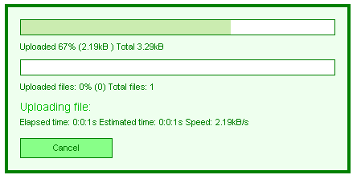

# Understanding the Skin CSS File


>caution  __RadUpload__ has been replaced by[RadAsyncUpload](http://demos.telerik.com/aspnet-ajax/asyncupload/examples/overview/defaultcs.aspx), Telerik’s next-generation ASP.NET upload component. If you are considering Telerik’s Upload control for new development, check out the[ documentation of RadAsyncUpload ](http://www.telerik.com/help/aspnet-ajax/asyncupload-overview.html)or the[control’s product page](http://www.telerik.com/products/aspnet-ajax/asyncupload.aspx). If you are already using __RadUpload__ in your projects, you may be interested in reading how easy the transition to RadAsyncUpload is and how you can benefit from it[in this blog post](http://blogs.telerik.com/blogs/12-12-05/the-case-of-telerik-s-new-old-asp.net-ajax-upload-control-radasyncupload). The official support for __RadUpload__ has been discontinued in June 2013 (Q2’13), although it is still be available in the suite. We deeply believe that __RadAsyncUpload__ can better serve your upload needs and we kindly ask you to transition to it to make sure you take advantage of its support and the new features we constantly add to it.
>


## 

Styles for RadControls are defined using Cascading Style Sheet (CSS) syntax. Each style consists of a selector that identifies an HTML element to be styled, and property/value pairs that describe each of the style specifics, e.g. color, padding, margins, etc. For example, the ".RadUpload_Default" style defines the text properties for all of the RadUpload controls using the "Default" skin. Additional selectors can override these properties for elements within the controls:

````ASPNET
	    .RadUpload_Default * 
	    { 
	        font-size:11px; 
	        line-height:1.24; 
	        font-family:arial,verdana,sans-serif;
	    }
	    
````


See the [CSS Skin File Selectors]() topic for more information on the specific CSS selectors used for __RadUpload__skins. You can see custom styles applied in the screenshot below:



Each style maps to a "class" attribute in an HTML tag. For example, consider the HTML rendering of the __RadProgressArea__ shown above:

````HTML
	    
	    <div id="RadProgressArea1" class="radupload RadUpload_Green " style="display: none;">
	        <div id="RadProgressArea1_Panel">
	            <ul class="ruProgress">
	                <li class="ruFilePortion">
	                    <div id="RadProgressArea1_Panel_PrimaryProgressBarOuterDiv" class="ruBar">
	                        <div id="RadProgressArea1_Panel_PrimaryProgressBarInnerDiv">
	                            <!-- -->
	                        </div>
	                    </div>
	                    Uploaded <span id="RadProgressArea1_Panel_PrimaryPercent"></span>% (<span id="RadProgressArea1_Panel_PrimaryValue"></span>
	                    ) Total <span id="RadProgressArea1_Panel_PrimaryTotal"></span></li>
	                <li class="ruFileCount">
	                    <div id="RadProgressArea1_Panel_SecondaryProgressBarOuterDiv" class="ruBar">
	                        <div id="RadProgressArea1_Panel_SecondaryProgressBarInnerDiv">
	                            <!-- -->
	                        </div>
	                    </div>
	                    Uploaded files: <span id="RadProgressArea1_Panel_SecondaryPercent"></span>% (<span
	                        id="RadProgressArea1_Panel_SecondaryValue"></span>) Total files: <span id="RadProgressArea1_Panel_SecondaryTotal">
	                        </span></li>
	                <li class="ruCurrentFile">Uploading file: <span id="RadProgressArea1_Panel_CurrentOperation">
	                </span></li>
	                <li class="ruTimeSpeed">Elapsed time: <span id="RadProgressArea1_Panel_TimeElapsed">
	                </span>&nbsp; Estimated time: <span id="RadProgressArea1_Panel_TimeEstimated"></span>
	                    &nbsp; Speed: <span id="RadProgressArea1_Panel_Speed"></span></li>
	                <li class="ruActions">
	                    <input name="RadProgressArea1$Panel$CancelButton" type="button" id="RadProgressArea1_Panel_CancelButton"
	                        value="Cancel" class="ruButton ruCancel" />
	                </li>
	            </ul>
	        </div>
	        <input id="RadProgressArea1_ClientState" name="RadProgressArea1_ClientState" type="hidden" /></div>
````


The dialog is rendered as a <div> element with the __radupload__and __RadUpload_Green__classes applied. The __radupload__class is always applied, and supplies the basic presentation of all __RadUpload__and __RadProgressArea__ controls, regardless of the skin. The __RadUpload_Green__class is applied because the __Skin__property was set to "Green".If no skin had been supplied, the <div> would only have the __radupload__class applied.

Inside the main <div> element is an unordered list (<ul> element) which is responsible for laying out the rows of the dialog. This <ul> element has the __ruProgress__class applied.

Each row is an <li> element, and has a class applied that identifies the row:

* The row with the __Total Progress Bar__ and __Total Progress Indicators__ has the __ruFilePortion__ class applied.

* The row with the __Files Count Bar__ and __Files Count Indicators__ has the __ruFileCount__ class applied.

* The row with the __Current File Name__ has the __ruCurrentFile__ class applied.

* The row with __Time and Speed Indicators__ has the __ruTimeSpeed__ class applied.

* The row with the __Cancel button__ has the __ruActions__ class applied.

Inside the rows, different types of elements get additional classes applied. For example, progress bars are <div> elements with the __ruBar__ class applied, while the cancel button is an <input> element with the __ruButton__ and __ruCancel__ classes applied.

Selectors in the CSS file identifies styles based on this rendering. Thus, a selector such as __.RadUpload_Green .ruBar__ would apply to both progress bars, while a selector such as __.RadUpload_Green .ruFilePortion .ruBar__ would apply only to the __Total Progress Bar__ but not the__Files Count Bar__.

# See Also

 * [File Input Appearance]()
