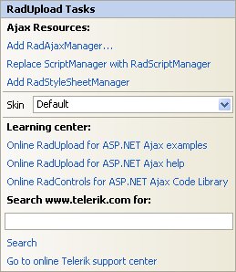
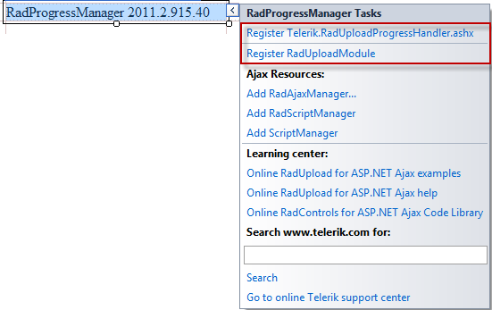
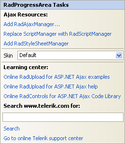

# Design Time

>caution  __RadUpload__ has been replaced by[RadAsyncUpload](http://demos.telerik.com/aspnet-ajax/asyncupload/examples/overview/defaultcs.aspx), Telerik’s next-generation ASP.NET upload component. If you are considering Telerik’s Upload control for new development, check out the[ documentation of RadAsyncUpload ](http://www.telerik.com/help/aspnet-ajax/asyncupload-overview.html)or the[control’s product page](http://www.telerik.com/products/aspnet-ajax/asyncupload.aspx). If you are already using __RadUpload__ in your projects, you may be interested in reading how easy the transition to RadAsyncUpload is and how you can benefit from it[in this blog post](http://blogs.telerik.com/blogs/12-12-05/the-case-of-telerik-s-new-old-asp.net-ajax-upload-control-radasyncupload). The official support for __RadUpload__ has been discontinued in June 2013 (Q2’13), although it is still be available in the suite. We deeply believe that __RadAsyncUpload__ can better serve your upload needs and we kindly ask you to transition to it to make sure you take advantage of its support and the new features we constantly add to it.
>

The Smart Tag allows easy access to frequently needed tasks. You can display the __Smart Tag__ by right clicking on a control in the design window, and choosing __Show Smart Tag__ from its context menu.

## RadUpload Smart Tag

The __RadUpload__Smart Tag lets you perform the following:

## Ajax Resources

* __Add RadAjaxManager...__ adds a RadAjaxManager component to your Web page, and displays the __r.a.d.ajax Property Builder__ where you can configure it.

* __Replace ScriptManager with RadScriptManager__ replaces the default __ScriptManager__ component that is added for AJAX-enabled Web sites with __RadScriptManager__.

* Add __RadStyleSheetManager__ adds a __RadStyleSheetManager__ to your Web page.

## Skin

The __Skin__ drop-down lets you select from a list of available [skins]() to customize the look of your __RadUpload__control.

## Learning Center

Links navigate you directly to __RadUpload__examples, help, or code library. You can also search the Telerik web site for a given string.

## RadProgressManager Smart Tag

As of 2008 Q3 SP1 (2008.3.1125), RadProgressManager can automatically register the [RadUploadHttpModule and RadUploadProgressHandler](FAFFEB65-66D2-4CFE-8F40-E4BA471540A9) in the web.config file.

## RadProgressArea Smart Tag

The RadProgressArea Smart Tag is exactly the same as the __RadUpload__ Smart Tag. The __Skin__ drop-down is available so that you can choose a skin for the progress dialog that it displays.

