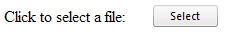

# How to Hide Input Textbox


>caution  **RadUpload** has been replaced by[RadAsyncUpload](http://demos.telerik.com/aspnet-ajax/asyncupload/examples/overview/defaultcs.aspx), Telerik’s next-generation ASP.NET upload component. If you are considering Telerik’s Upload control for new development, check out the[ documentation of RadAsyncUpload ](http://www.telerik.com/help/aspnet-ajax/asyncupload-overview.html)or the[control’s product page](http://www.telerik.com/products/aspnet-ajax/asyncupload.aspx). If you are already using **RadUpload** in your projects, you may be interested in reading how easy the transition to RadAsyncUpload is and how you can benefit from it[in this blog post](http://blogs.telerik.com/blogs/12-12-05/the-case-of-telerik-s-new-old-asp.net-ajax-upload-control-radasyncupload). The official support for **RadUpload** has been discontinued in June 2013 (Q2’13), although it is still be available in the suite. We deeply believe that **RadAsyncUpload** can better serve your upload needs and we kindly ask you to transition to it to make sure you take advantage of its support and the new features we constantly add to it.
>


## 

This article shows how to completely hide the input textbox field of the RadUpload so that onlythe Select button is shown.

Here is the RadUpload declaration:

````ASPNET
	    <telerik:radupload id="RadUpload1" runat="server" width="230px" controlobjectsvisibility="None"
	        targetfolder="uploads" initialfileinputscount="1">              
	    </telerik:radupload>
````


Here is the CSS rules you need to place in the <head> section of your page:

````ASPNET
	    <style type="text/css">
	        div.RadUpload .ruFakeInput
	        {
	            visibility: hidden;
	            width: 0;
	            padding: 0;
	        }
	        div.RadUpload .ruFileInput
	        {
	            width: 1;
	        }
	    </style>
````


Here is the final result:




# See Also

 * [Auto Upload a File]()
