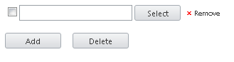

# How to Place the Submit Button Inside the Upload Container


>caution  **RadUpload** has been replaced by[RadAsyncUpload](http://demos.telerik.com/aspnet-ajax/asyncupload/examples/overview/defaultcs.aspx), Telerik’s next-generation ASP.NET upload component. If you are considering Telerik’s Upload control for new development, check out the[ documentation of RadAsyncUpload ](http://www.telerik.com/help/aspnet-ajax/asyncupload-overview.html)or the[control’s product page](http://www.telerik.com/products/aspnet-ajax/asyncupload.aspx). If you are already using **RadUpload** in your projects, you may be interested in reading how easy the transition to RadAsyncUpload is and how you can benefit from it[in this blog post](http://blogs.telerik.com/blogs/12-12-05/the-case-of-telerik-s-new-old-asp.net-ajax-upload-control-radasyncupload). The official support for **RadUpload** has been discontinued in June 2013 (Q2’13), although it is still be available in the suite. We deeply believe that **RadAsyncUpload** can better serve your upload needs and we kindly ask you to transition to it to make sure you take advantage of its support and the new features we constantly add to it.
>


## 

Usually, the submit button which sends the file to the server is placed outside the upload div.

This example show how to place the submit button inside the upload div, reside in the button area(next to the Add and Delete buttons) and have the look of the other upload buttons.


````ASPNET
	    <telerik:radupload id="RadUpload1" runat="server" skin="Web20" />
````


````JavaScript
	
	        function pageLoad() {
	            var upload = $find("<%= RadUpload1.ClientID %>");
	            var uploadDiv = upload.get_element();
	
	            var input = document.createElement("input");
	            input.type = "submit";
	            input.className = "ruButton";
	            input.value = "Submit";
	            input.id = input.name = upload.getID("submit");
	            if (document.getElementById(input.id) != null)
	                return;
	
	            //the UL element of the upload
	            var ul = uploadDiv.getElementsByTagName("UL");
	            //the array of all LI elements of the UL element
	            var LIs = ul[0].getElementsByTagName("LI");
	            //Last LI item - the button area
	            var lastLi = LIs[LIs.length - 1];
	            lastLi.appendChild(input);
	        }
````


Here is the result:

**Before:**




**After:**


