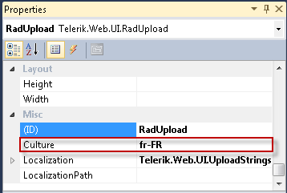

# Localizing RadUpload


>caution  **RadUpload** has been replaced by [RadAsyncUpload](http://demos.telerik.com/aspnet-ajax/asyncupload/examples/overview/defaultcs.aspx), Telerik’s next-generation ASP.NET upload component. If you are considering Telerik’s Upload control for new development, check out the [documentation of RadAsyncUpload ](http://www.telerik.com/help/aspnet-ajax/asyncupload-overview.html) or the [control’s product page](http://www.telerik.com/products/aspnet-ajax/asyncupload.aspx). If you are already using **RadUpload** in your projects, you may be interested in reading how easy the transition to RadAsyncUpload is and how you can benefit from it [in this blog post](http://blogs.telerik.com/blogs/12-12-05/the-case-of-telerik-s-new-old-asp.net-ajax-upload-control-radasyncupload). The official support for **RadUpload** has been discontinued in June 2013 (Q2’13), although it is still be available in the suite. We deeply believe that **RadAsyncUpload** can better serve your upload needs and we kindly ask you to transition to it to make sure you take advantage of its support and the new features we constantly add to it.
>


The localization support for **RadUpload** lets you completely translate the user interface, or simply adapt a few strings.

## Localization property

The **Localization** property specifies the strings that appear in the runtime user interface of **RadUpload**. By changing the values of each named sub-property, you change the appearance of the string the upload uses:

````ASPNET
<telerik:radupload 
    id="RadUpload1" runat="server" localization-add="Add New File"
    localization-select="Select zip file" />
````


````C#
	     
RadUpload1.Localization.Delete = "Delete Selected";
				
````


>note This technique is useful when customizing some of the messages of a particular instance. The messages are not shared between upload instances. A complete translation using this approach is not appropriate.
>


>caption  

| Key | Default Value | Description |
| ------ | ------ | ------ |
|"Add"|"Add"|Sets the text of the **Add** button. This button does not appear when **ControlObjectsVisibility** does not include " **AddButton** "|
|"Clear"|"Clear"|Sets the text of the **Clear** button. This button does not appear when **ControlObjectsVisibility** does not include " **ClearButtons** "|
|"Delete"|"Delete"|Sets the text of the **Delete** button. This button does not appear when **ControlObjectsVisibility** does not include " **DeleteSelectedButton** "|
|"Remove"|"Remove"|Sets the text of the **Remove** button. This button does not appear when **ControlObjectsVisibility** does not include " **RemoveButtons** "|
|"Select"|"Select"|Sets the text of the **Select** button. This button always appears|


## Global Resource Files

The primary means for localization in ASP.NET is to use resource files. Resource files are simple XML files that can be easily edited and transferred to other applications. You can use resource files to change the default (English) localization for **RadUpload** that is stored in the Telerik.Web.UI assembly.

To create a global resource file to localize the upload follow these steps:

1. Create the **App_GlobalResources** folder in the root of your web application. 2. Copy the default resource **RadUpload.resx** file into it. This file can be found in the **App_GlobalResources** folder of the directory where you installed the RadControls. 3. Make a copy of the file and rename the copy so that its name contains the Culture Identifier. The resource files used by RadUpload follow a strict naming convention:

	**RadUpload.`<Culture Identifier>`.resx**

	>note The **Culture Identifier** consists of a language code followed by a dash and the country code.Example: “en-US”, “fr-CA” and so on.
	>


	For example RadUpload.fr-CA.resx. Both files should be present in the App_GlobalResources folder:

	

2. Edit the strings using the Visual Studio editor or your favorite text editor. Customize strings just as you would set the **Localization** property.

	

>caution Make sure that the **ReservedResource** message is preserved. It is used for identification purposes and is never displayed.
>


You can now switch the upload so that it uses your new resource file by setting the active culture:



# See Also[](BCC18A1A-3EF6-44C2-A38B-D5BB8CE9BFD1)

 * [RadUpload RTL Support]()
