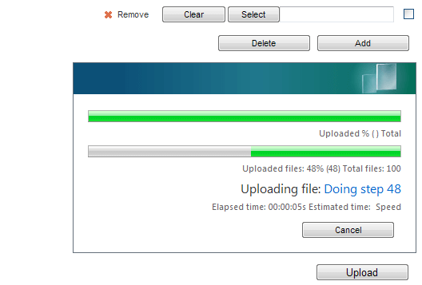

# RadUpload RTL Support


>caution  **RadUpload** has been replaced by[RadAsyncUpload](http://demos.telerik.com/aspnet-ajax/asyncupload/examples/overview/defaultcs.aspx), Telerik’s next-generation ASP.NET upload component. If you are considering Telerik’s Upload control for new development, check out the[ documentation of RadAsyncUpload ](http://www.telerik.com/help/aspnet-ajax/asyncupload-overview.html)or the[control’s product page](http://www.telerik.com/products/aspnet-ajax/asyncupload.aspx). If you are already using **RadUpload** in your projects, you may be interested in reading how easy the transition to RadAsyncUpload is and how you can benefit from it[in this blog post](http://blogs.telerik.com/blogs/12-12-05/the-case-of-telerik-s-new-old-asp.net-ajax-upload-control-radasyncupload). The official support for **RadUpload** has been discontinued in June 2013 (Q2’13), although it is still be available in the suite. We deeply believe that **RadAsyncUpload** can better serve your upload needs and we kindly ask you to transition to it to make sure you take advantage of its support and the new features we constantly add to it.
>


## 

**RadUpload** and **RadProgressArea** include support for right-to-left locales using the direction attribute. If you set **dir="rtl"** on the **RadUpload** and/or **RadProgressArea** objects or to any parent HTML element, the controls reverse elements order and align themselves to the right side of its container:

````ASPNET
	     
	
	         <telerik:RadUpload ID="RadUpload1"
	            runat="server"
	            dir="rtl"
	            Skin="Vista"
	            ControlObjectsVisibility="all">
	        </telerik:RadUpload><br />
	        <telerik:RadProgressArea ID="RadProgressArea1"
	            runat="server"
	            Skin="Vista"
	            dir="rtl"
	            DisplayCancelButton="true">
	        </telerik:RadProgressArea>
	
				
````


This produces the following result:

# See Also

 * [Localizing RadUpload]()[](BCC18A1A-3EF6-44C2-A38B-D5BB8CE9BFD1)
