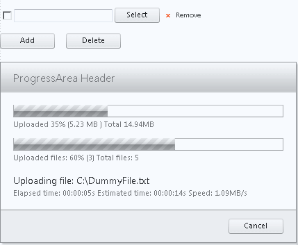

# Upload Overview

>caution  __RadUpload__ has been replaced by[RadAsyncUpload](http://demos.telerik.com/aspnet-ajax/asyncupload/examples/overview/defaultcs.aspx), Telerik’s next-generation ASP.NET upload component. If you are considering Telerik’s Upload control for new development, check out the[ documentation of RadAsyncUpload ](http://www.telerik.com/help/aspnet-ajax/asyncupload-overview.html)or the[control’s product page](http://www.telerik.com/products/aspnet-ajax/asyncupload.aspx). If you are already using __RadUpload__ in your projects, you may be interested in reading how easy the transition to RadAsyncUpload is and how you can benefit from it[in this blog post](http://blogs.telerik.com/blogs/12-12-05/the-case-of-telerik-s-new-old-asp.net-ajax-upload-control-radasyncupload). The official support for __RadUpload__ has been discontinued in June 2013 (Q2’13), although it is still be available in the suite. We deeply believe that __RadAsyncUpload__ can better serve your upload needs and we kindly ask you to transition to it to make sure you take advantage of its support and the new features we constantly add to it.
>

__Telerik RadUpload__ is a set of three controls for uploading files and monitoring the progress of uploads (or other long processes). These controls provide tight integration with ASP.NET AJAX. __RadUpload for ASP.NET AJAX__ contains:

* __RadProgressManager__ - a non-visual element to manage the process of file uploads and progress monitoring.

* __RadUpload__ - a control for single- and multi-file uploads, integrated file validation and more.

* __RadProgressArea -__ a control for displaying progress dialogs: automatically monitoring file uploads and optionally monitoring any other measurable process on the server.

## RadProgressManager

__RadProgressManager__ enables the following features:

* Management of [file uploads]() and __progress monitoring__.

* Works with [standard files inputs]() (<input type=file> elements) as well as the __RadUpload__ control.

* [Client-side API](E9863C1B-4C24-456F-8640-BA6A83203777) lets you manipulate the progress monitoring feature client-side and respond to [client-side events]().

## RadUpload

__RadUpload__ is a single- and multi-file upload control that provides the following features:

* [Automatic file saving]() - __RadUpload__ can automatically save its uploaded files to a selected folder.

* [Integrated validation]() - __RadUpload__ can automatically validate uploaded files for file extension, MIME type, and file size.

* __Custom validation__ - RadUpload makes it easy to provide your own custom validation, both [server-side](), or [client-side using ASP.NET validators]().

* [Server-side API for manipulating files](FC66018F-9560-4F29-A685-C6DC5D9BF5C9) - in more complex scenarios you can save the uploaded files with server-side code and still benefit from the integrated file validation.

* [Custom Fields]() - __RadUpload__lets you add custom fields to each file input. Using this functionality you can add fields like Title, Description, etc. to each file it uploads.

* [Configurable User Interface]() - you can fully customize the controls that are integrated into __RadUpload__.

* [Skins]() provide an easy way to make the look-and-feel harmonize with the rest of your Web site.

* A rich [client-side API]() for manipulating the control and responding to [client-side events]().

## RadProgressArea

__RadProgressArea__ is a progress-monitoring control that displays a progress dialog to display the current progress of a file upload or other lengthy process.__RadProgressArea__ provides the following features:

* [Automatic file upload monitoring](D64A315E-6A3F-4986-80A0-A84BC2E3FE06) - you can monitor the progress of any file upload

* [Custom progress monitoring](CA8786F9-D48D-4423-92EA-D2C8907D19BA) - with minimal server-side code you can monitor the progress of any measurable server-side process, such as mathematical calculations or database queries.

* [Configurable user interface](38840C58-5CBE-449E-8F91-D9C5937769BE) - you have full control over what indicators and controls appear in the progress dialog.

* [Progress templates](D1C46DCE-C13E-4850-8DB2-549FC00ED728) - you can further customize the progress dialog by creating a progress template that includes your own controls and elements. In most of the cases you don't need to write any javascript to ensure the proper operation of the control.

* [Skins]() provide an easy way to make the look-and-feel harmonize with the rest of your Web site.

* [Client-side API](F07E2354-2B45-479D-983B-0CF4A70D4446) - you can manipulate the progress dialog from client-side code and respond to [client-side events]().

## Browser Support

Telerik RadUpload supports all major browsers and platforms (both on PC and Mac, where applicable):

* Internet Explorer 5.5+;

* all Gecko-based browsers - Mozilla 1.0+, FireFox 0.8+, Netscape 7+;

* Opera 8.0+ (Possible problems with __RadProgressArea__ on some platforms)

* Safari 2.0.4+

