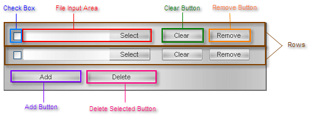

# RadUpload Structure

>caution  __RadUpload__ has been replaced by[RadAsyncUpload](http://demos.telerik.com/aspnet-ajax/asyncupload/examples/overview/defaultcs.aspx), Telerik’s next-generation ASP.NET upload component. If you are considering Telerik’s Upload control for new development, check out the[ documentation of RadAsyncUpload ](http://www.telerik.com/help/aspnet-ajax/asyncupload-overview.html)or the[control’s product page](http://www.telerik.com/products/aspnet-ajax/asyncupload.aspx). If you are already using __RadUpload__ in your projects, you may be interested in reading how easy the transition to RadAsyncUpload is and how you can benefit from it[in this blog post](http://blogs.telerik.com/blogs/12-12-05/the-case-of-telerik-s-new-old-asp.net-ajax-upload-control-radasyncupload). The official support for __RadUpload__ has been discontinued in June 2013 (Q2’13), although it is still be available in the suite. We deeply believe that __RadAsyncUpload__ can better serve your upload needs and we kindly ask you to transition to it to make sure you take advantage of its support and the new features we constantly add to it.
>

## 

The __RadUpload__ control is laid out in rows, as shown below:

* The number of rows is controlled by the __InitialFileInputsCount__ and __MaxFileInputsCount__ properties.

* Each row always contains a __file input area__, which behaves like an HTML __input__ element with __type__ set to "file", but has a more customizable look and feel.

* To the left of the file input area appears an optional __check box__. The check box allows users to select a row for deletion. The check box appears if the __ControlObjectsVisibility__ property includes "CheckBoxes".

* To the right of the file input area appear an optional __clear button__ and/or __remove button__. The clear button deletes the current value in the file input area, and the remove button deletes the entire row. These buttons appear if the __ControlObjectsVisibility__ property includes "ClearButtons" and/or "RemoveButtons".

* Below the rows appears the optional __add button__. The add button lets users add additional rows (up to __MaxFileInputsCount__). The add button appears if the __ControlObjectsVisibility__ property includes "AddButton".

* Also below the rows appears the optional __delete selected button__. This button behaves like the remove buttons, except that it operates on all rows that are selected using the check boxes. The delete selected button appears if the __ControlObjectsVisibility__ property include "DeleteSelectedButton"

# See Also

 * [Configure the UI of RadUpload]()

 * [File Input Appearance]()
