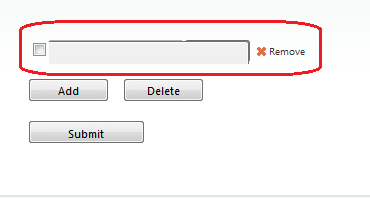
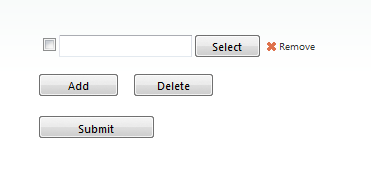

# RadUpload Select or Browse Button Is Not Visible in IE

## 

In very rare cases the fileinputs and Select/Browse button do not show up at all in IE6, 7 and 8 as demonstrated in the image below. In fact the issue is a bug in IE6, 7 and 8 where the opacity filter is implemented as an ActiveX control and it gets buggy in case there are more strict security rules applied.

Unfortunately we could not reproduce the issue locally but we could manage to come up with several workaround with the greatly appreciated help of our customers.

1. The first and the easiest one you could try is to set the **EnableFileInputSkinning** property of the RadUpload to *false*:

1. The second one is simply to add the following css styles to the page that contains the RadUpload control:

