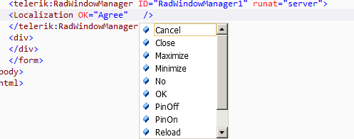
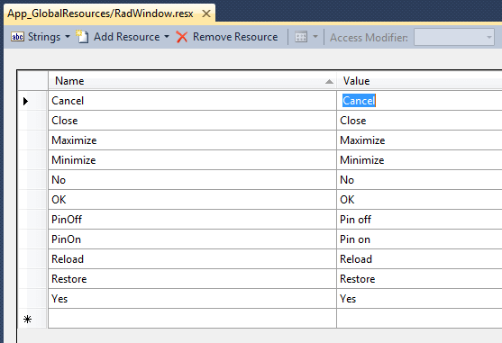

# Localization


__RadWindow__ and __RadWindowManager__ provide a mechanism for easy localization of the command buttons' tooltips and the predefine dialogs' button texts. It is based on the native ASP.NET localization and thus requires that the new string is set to the corresponding property. You can do this either via a resource (.resx) files, or by hardcoding the values in the ASPX or code-behind.

To activate the localization you need to use the __Localization__ property and declare the strings you wish to localize in it:

## Providing values declaratively

The easiest way is to just set a string that you wish to use instead of the built-in ones, for example:

````ASPNET
	    <telerik:RadWindow runat="server" ID="RadWindow1">
	        <Localization Maximize="Maximize the RadWindow" Close="Close this popup" />
	    </telerik:RadWindow>
````


Or through the code-behind:


````C#
	            RadWindow1.Localization.Close = "Close this popup";
	            RadWindow1.Localization.Maximize = "Maximize the RadWindow";
````
````VB.NET
	        RadWindow1.Localization.Close = "Close this popup";
	        RadWindow1.Localization.Maximize = "Maximize the RadWindow";
	#End Region
	
		#Region window-wai-aria-support_2
		RadWindow1.EnableAriaSupport = true
		RadWindowManager1.EnableAriaSupport = true
	#End Region
	End Class


## Using the ASP.NET resource files

You need to create the resource (*.resx) files in the __App_GlobalResources__ folder of your web application and name them accordingly:__RadWindow.<language>.resx__. Then you need to point the __Localization__ property to read the resource files:

````ASPNET
	    <telerik:RadWindow runat="server" ID="RadWindow1">
	    <Localization Maximize="<%$ Resources:RadWindow, Maximize %>" Minimize="<%$ Resources:RadWindow, Minimize %>"
	            Close="<%$ Resources:RadWindow, Close %>" PinOff="<%$ Resources:RadWindow, PinOff %>"
	            PinOn="<%$ Resources:RadWindow, PinOn %>" Reload="<%$ Resources:RadWindow,Reload %>"
	            Restore="<%$ Resources:RadWindow, Restore%>" Cancel="<%$ Resources:RadWindow, Cancel %>"
	            OK="<%$ Resources:RadWindow, OK %>" No="<%$ Resources:RadWindow, No %>" Yes="<%$ Resources:RadWindow, Yes %>" />
	    </telerik:RadWindow>
````



## Setting values through JavaScript

You can also set the localization strings through JavaScript as shown in [this KB article](http://www.telerik.com/support/kb/aspnet-ajax/window/radwindow-for-asp-net-ajax-localization.aspx).

# See Also

 * [RadWindow Localization Demo](http://demos.telerik.com/aspnet-ajax/window/examples/localization/defaultcs.aspx)
