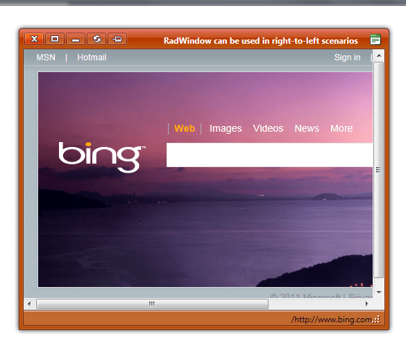

# Right-to-left Support

The **RadWindow** fully supports right-to-left (RTL) language locales. The **RadWindows** are rendered to the page as children of the form element and in order to turn on the RTL support you should set **dir=rtl to the html or body** elements.

````CSS
html
{
	direction: rtl;
}
````


````ASP.NET
<telerik:RadWindow RenderMode="Lightweight" runat="server" Width="550" Title="RadWindow can be used in right-to-left scenarios"
	Height="450px" VisibleOnPageLoad="true" NavigateUrl="http://www.bing.com/" Skin="Sunset"
	ID="Radwindow1">
</telerik:RadWindow>
````



## See Also

 * [See this live in an online demo](http://demos.telerik.com/aspnet-ajax/window/examples/righttoleft/defaultcs.aspx)
