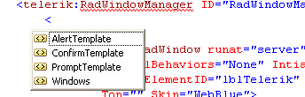

# How to Change the Dialog Templates

The look of the predefined dialogs that appear when you call **RadAlert, RadConfirm**, or **RadPrompt** is controlled by templates that correspond to each dialog. To get the current code for these templates, you need to put a RadWindowManager on your page, run it in your browser and examine the HTML dump. Below you can find examples of the default templates throughout different control versions and Render Modes.

The parameters provided to the template are the following:

* {0} - RadWindow's popup client ID
* {1} - Text to show
* {2} - Default text (for the prompt template)

You can change the look of the alert, confirm, and prompt dialogs in your application by changing these templates.There are two ways to change the template that the **RadWindowManager** in your application uses:	in the markup or by creating them in the code-behind. Information for both of them is available in the article below.

>important You can only use plain HTML in the templates, server controls are not supported and may even result in errors.

This topic contains the following sections.

* [Templates for Lightweight RenderMode since Q2 2016](#templates-for-lightweight-rendermode-since-q2-2016)
* [Templates for Lightweight RenderMode since Q2 2013](#templates-for-lightweight-rendermode-since-q2-2013)
* [Templates for Classic RenderMode since Q1 2009](#templates-for-classic-rendermode-since-q1-2009)
* [Templates for versions prior to Q1 2009](#templates-for-versions-prior-to-q1-2009)
* [Changing the Templates through the Markup](#changing-the-templates-through-the-markup)
* [Changing the Templates through the Code-Behind](#changing-the-templates-through-the-code-behind)

## Templates for Lightweight RenderMode since Q2 2016

````ASP.NET
<telerik:RadWindowManager ID="RadWindowManager1" runat="server" RenderMode="Lightweight">
	<AlertTemplate>
		<div class="rwDialog rwAlertDialog">
			<div class="rwDialogContent">
				<div class="rwDialogMessage">{1}</div>
			</div>
			<div class="rwDialogButtons">
				<button type="button" class="rwOkBtn" onclick="$find('{0}').close(true); return false;">##LOC[OK]##</button>
			</div>
		</div>
	</AlertTemplate>
	<PromptTemplate>
		<div class="rwDialog rwPromptDialog">
			<div class="rwDialogContent">
				<div class="rwDialogMessage">{1}</div>
				<div class="rwPromptInputContainer">
					<script type="text/javascript">
						function RadWindowprompt_detectenter(id, ev, input) {
							if (!ev) ev = window.event;
							if (ev.keyCode == 13) {
								var but = input.parentNode.parentNode.parentNode.getElementsByTagName("button")[0];
								if (but) {
									if (but.click) {
										but.click();
									}
									else if (but.onclick) {
										but.focus();
										var click = but.onclick;
										but.onclick = null;
										if (click) click.call(but);
									}
								}
								return false;
							}
							else return true;
						}
					</script>
					<input title="Enter Value" onkeydown="return RadWindowprompt_detectenter('{0}', event, this);" type="text" class="rwPromptInput radPreventDecorate" value="{2}" />
				</div>
			</div>
			<div class="rwDialogButtons">
				<button type="button" class="rwOkBtn" onclick="$find('{0}').close(this.parentNode.parentNode.getElementsByTagName('input')[0].value); return false;">##LOC[OK]##</button>
				<button type="button" class="rwCancelBtn" onclick="$find('{0}').close(null); return false;">##LOC[Cancel]##</button>
			</div>
		</div>
	</PromptTemplate>
	<ConfirmTemplate>
		<div class="rwDialog rwConfirmDialog">
			<div class="rwDialogContent">
				<div class="rwDialogMessage">{1}</div>
			</div>
			<div class="rwDialogButtons">
				<button type="button" class="rwOkBtn" onclick="$find('{0}').close(true); return false;">##LOC[OK]##</button>
				<button type="button" class="rwCancelBtn" onclick="$find('{0}').close(false); return false;">##LOC[Cancel]##</button>
			</div>
		</div>
	</ConfirmTemplate>
</telerik:RadWindowManager>
````

## Templates for Lightweight RenderMode since Q2 2013

````ASP..NET
<telerik:RadWindowManager ID="RadWindowManager1" runat="server" RenderMode="Lightweight">
	<AlertTemplate>
		<div class="rwDialog rwAlertDialog">
			<div class="rwDialogContent">
				<div class="rwDialogMessage">
					{1}
				</div>
			</div>
			<div class="rwDialogButtons">
				<input type="button" value="OK" class="rwOkBtn" onclick="$find('{0}').close(true); return false;" />
			</div>
		</div>
	</AlertTemplate>
	<PromptTemplate>
		<div class="rwDialog rwPromptDialog">
			<div class="rwDialogContent">
				<div class="rwDialogMessage">{1}</div>
				<div class="rwPromptInputContainer">
					<script type="text/javascript">
						function RadWindowprompt_detectenter(id, ev, input)
						{
							if (!ev)
								ev = window.event;
							if (ev.keyCode == 13)
							{
								var but = input.parentNode.parentNode.getElementsByTagName("A")[0];
								if (but)
								{
									if (but.click)
										but.click();
									else if (but.onclick)
									{
										but.focus();
										var click = but.onclick;
										but.onclick = null;
										if (click)
											click.call(but);
									}
								}
								return false;
							}
							else
								return true;
						}
					</script>
					<input title="Enter Value" onkeydown="return RadWindowprompt_detectenter('{0}', event, this);" type="text"  class="rwPromptInput radPreventDecorate" value="{2}" />
				</div>
			</div>
			<div class="rwDialogButtons">
				<input type="button" value="OK" class="rwOkBtn" onclick="$find('{0}').close(this.parentNode.parentNode.getElementsByTagName('input')[0].value); return false;" />
				<input type="button" value="Cancel" class="rwCancelBtn" onclick="$find('{0}').close(null); return false;" />
			</div>
		</div>
	</PromptTemplate>
	<ConfirmTemplate>
		<div class="rwDialog rwConfirmDialog">
			<div class="rwDialogContent">
				<div class="rwDialogMessage">{1}</div>
			</div>
			<div class="rwDialogButtons">
				<input type="button" value="OK" class="rwOkBtn" onclick="$find('{0}').close(true); return false;" />
				<input type="button" value="Cancel" class="rwCancelBtn" onclick="$find('{0}').close(false); return false;" />
			</div>
		</div>
	</ConfirmTemplate>
</telerik:RadWindowManager>
````

## Templates for Classic RenderMode since Q1 2009

````ASP.NET
<telerik:RadWindowManager ID="RadWindowManager2" runat="server" RenderMode="Classic">
	<AlertTemplate>
		<div class="rwDialogPopup radalert">
			<div class="rwDialogText">
				{1}
			</div>
			<div>
				<a onclick="$find('{0}').close();" class="rwPopupButton" href="javascript:void(0);">
					<span class="rwOuterSpan"><span class="rwInnerSpan">##LOC[OK]##</span> </span>
				</a>
			</div>
		</div>
	</AlertTemplate>
	<PromptTemplate>
		<div class="rwDialogPopup radprompt">
			<div class="rwDialogText">
				{1}
			</div>
			<div>
				<script type="text/javascript">
					function RadWindowprompt_detectenter(id, ev, input)
					{
						if (!ev) ev = window.event;
						if (ev.keyCode == 13)
						{
							var but = input.parentNode.parentNode.getElementsByTagName("A")[0];
							if (but)
							{
								if (but.click) but.click();
								else if (but.onclick)
								{
									but.focus(); var click = but.onclick; but.onclick = null; if (click) click.call(but);
								}
							}
							return false;
						}
						else return true;
					}  
				</script>
				<input onkeydown="return RadWindowprompt_detectenter('{0}', event, this);" type="text"
					class="rwDialogInput" value="{2}" />
			</div>
			<div>
				<a onclick="$find('{0}').close(this.parentNode.parentNode.getElementsByTagName('input')[0].value);"
					class="rwPopupButton" href="javascript:void(0);"><span class="rwOuterSpan"><span
						class="rwInnerSpan">##LOC[OK]##</span></span></a> <a onclick="$find('{0}').close(null);"
							class="rwPopupButton" href="javascript:void(0);"><span class="rwOuterSpan"><span
								class="rwInnerSpan">##LOC[Cancel]##</span></span></a>
			</div>
		</div>
	</PromptTemplate>
	<ConfirmTemplate>
		<div class="rwDialogPopup radconfirm">
			<div class="rwDialogText">
				{1}
			</div>
			<div>
				<a onclick="$find('{0}').close(true);" class="rwPopupButton" href="javascript:void(0);">
					<span class="rwOuterSpan"><span class="rwInnerSpan">##LOC[OK]##</span></span></a>
				<a onclick="$find('{0}').close(false);" class="rwPopupButton" href="javascript:void(0);">
					<span class="rwOuterSpan"><span class="rwInnerSpan">##LOC[Cancel]##</span></span></a>
			</div>
		</div>
	</ConfirmTemplate>
</telerik:RadWindowManager>
````

## Templates for versions prior to Q1 2009

````ASP.NET
<telerik:RadWindowManager ID="RadWindowManager3" runat="server">
	<AlertTemplate>
		<div class="windowpopup radalert">
			<div class="dialogtext">
				{1}
			</div>
			<div>
				<a onclick="$find('{0}').close();" class="radwindowbutton" href="javascript:void(0);">
					<span class="outerspan"><span class="innerspan">##LOC[OK]##</span> </span></a>
			</div>
		</div>
	</AlertTemplate>
	<PromptTemplate>
		<div class="windowpopup radprompt">
			<div class="dialogtext">
				{1}
			</div>
			<div>
				<script type="text/javascript">
					function radwindowprompt_detectenter(id, ev, input)
					{
						if (!ev) ev = window.event;
						if (ev.keyCode == 13)
						{
							var but = input.parentNode.parentNode.getElementsByTagName("A")[0];
							if (but)
							{
								if (but.click) but.click();
								else if (but.onclick)
								{
									but.focus(); var click = but.onclick; but.onclick = null; if (click) click.call(but);
								}
							}
							return false;
						}
						else return true;
					}  
				</script>
				<input onkeydown="return radwindowprompt_detectenter('{0}', event, this);" type="text"
					class="dialoginput" value="{2}" />
			</div>
			<div>
				<a onclick="$find('{0}').close(this.parentNode.parentNode.getElementsByTagName('input')[0].value);"
					class="radwindowbutton" href="javascript:void(0);"><span class="outerspan"><span
						class="innerspan">##LOC[OK]##</span></span></a> <a onclick="$find('{0}').close(null);"
							class="radwindowbutton" href="javascript:void(0);"><span class="outerspan"><span
								class="innerspan">##LOC[Cancel]##</span></span></a>
			</div>
		</div>
	</PromptTemplate>
	<ConfirmTemplate>
		<div class="windowpopup radconfirm">
			<div class="dialogtext">
				{1}
			</div>
			<div>
				<a onclick="$find('{0}').close(true);" class="radwindowbutton" href="javascript:void(0);">
					<span class="outerspan"><span class="innerspan">##LOC[OK]##</span></span></a>
				<a onclick="$find('{0}').close(false);" class="radwindowbutton" href="javascript:void(0);">
					<span class="outerspan"><span class="innerspan">##LOC[Cancel]##</span></span></a>
			</div>
		</div>
	</ConfirmTemplate>
</telerik:RadWindowManager>
````

## Changing the Templates through the Markup

1. Go to the Source view of your HTML page and locate the tag that defines your **RadWindowManager**.

1. Inside the RadWindowManager tag, just before the window definitions, type the start of a new tag (`<`).

1. A window pops up letting you choose the template you want to enter:Note that you can enter a template for **RadWindow** objects that the manager creates as well as for the alert, confirm, and prompt templates.

	

1. Add your new template to the **RadWindowManager**. For example:

	**ASP.NET**
	    
		<telerik:RadWindowManager ID="RadWindowManager1" runat="server">
			<AlertTemplate>
				<div class="rwDialogPopup radalert">
					<div class="rwDialogText">
						{1}
					</div>
					<div>
						<a onclick="$find('{0}').close();" class="rwPopupButton" href="javascript:void(0);">
							<span class="rwOuterSpan"><span class="rwInnerSpan">##LOC[OK]##</span> </span>
						</a>
					</div>
				</div>
			</AlertTemplate>
		</telerik:RadWindowManager>

## Changing the Templates through the Code-Behind

The second way to change the template that the **RadWindowManager** in your application uses is to create a Web User Control for the template and assign that template in code.The RadWindowManager object has three properties, **AlertTemplate**, **ConfirmTemplate**, and **PromptTemplate**, to which you can assign the new template.

1. In the Project Explorer, right click on the project and select **Add New Item...**

1. Select Web User Control, and give the new template the name "AlertTemplate.ascx".

1. In the AlertTemplate.ascx file, design your new template. For example

	**ASP.NET**
		
		<%@  control language="C#" classname="AlertTemplate" %>
		<div class="rwDialogPopup radalert">
			<div class="rwDialogText">
				{1}
			</div>
			<div>
				<a onclick="$find('{0}').close();" class="rwPopupButton" href="javascript:void(0);">
					<span class="rwOuterSpan"><span class="rwInnerSpan">##LOC[OK]##</span> </span>
				</a>
			</div>
		</div>

1. Each of the Template properties is an ITemplate type. Implement an ITemplate class to load the new Web User Control that you defined. This class gains a reference to the web page in its constructor. The implementation of the one ITemplate method, **InstantiateIn**(), then loads the Web User Control onto that page and adds it to the supplied owner:

	**C#**
	
		class AlertTemplate : ITemplate
		{
			private Page _page;
			public AlertTemplate(Page page)
			{
				this._page = page;
			}
			void ITemplate.InstantiateIn(Control owner)
			{
				Control ctrl = _page.LoadControl("AlertTemplate.ascx");
				owner.Controls.Add(ctrl);
			}
		} 
	
	**VB**	
	
	    Class AlertTemplate
	        Implements ITemplate
	        Private _page As Page
	        Public Sub New(ByVal page As Page)
	            Me._page = page
	        End Sub
	        Sub InstantiateIn(ByVal owner As Control) Implements ITemplate.InstantiateIn
	            Dim ctrl As Control = _page.LoadControl("AlertTemplate.ascx")
	            owner.Controls.Add(ctrl)
	        End Sub
	    End Class

1. In the **Page_Load** event handler of the page that contains your **RadWindowManager**, create an instance of your new ITemplate class and assign the instance as the value of the appropriate template property:

	**C#**
	
		protected void Page_Load(object sender, EventArgs e)
		{
			this.RadWindowManager1.AlertTemplate = new AlertTemplate(this.Page);
		} 
	
	**VB**
	
	    Protected Sub Page_Load(ByVal sender As Object, ByVal e As EventArgs)
	        Me.RadWindowManager1.AlertTemplate = New AlertTemplate(Me.Page)
	    End Sub


