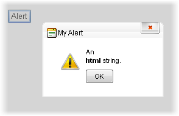

# RadAlert Dialog


>important In order to use this dialog you need to have a __RadWindowManager__ on the page.
>


## 

The easiest of the three built-in dialogs is the __RadAlert__. This dialog only requires a single parameter: the string to display. This string can also contain HTML markup. Optionally, you can provide additional parameters to supply the dialog width and height, a title string, a callback function and an URL to replace its original image.

## Calling RadAlert via JavaScript

The minimum required to show a __RadAlert__ is the content string:

````ASPNET
	     
	
	<button onclick="radalert('An <br /><b>html</b> string.<br />'); return false;"> Alert</button>
				
````


The full syntax of the radalert() function is as follows:

````JavaScript
	     
	
	var oAlert = radalert(text, oWidth, oHeight, oTitle, callbackFn, imgUrl);
				
````


where you can set optional width, height, title, a callback function and an URL to replace the image for the __RadAlert__ dialog.The callback function receives an argument that reflects the user action with the dialog.

This method also returns a reference to the RadAlert object (which is essentially a RadWindow), so you can use the [RadWindow's client-side API]() on it to further change it (titlebar icon, behaviors, etc.)

## Calling RadAlert from the code-behind

Since Q1 2011 the __RadWindowManager__ offers a built-in server-side method to call the __RadAlert__:

````ASPNET
		<telerik:RadWindowManager runat="server" id="RadWindowManager1"></telerik:RadWindowManager>
		<script type="text/javascript">
			function callBackFn(arg)
			{
				alert("this is the client-side callback function. The RadAlert returned: " + arg);
			}
		</script>
````


>tabbedCode

````C#
	    RadWindowManager1.RadAlert("An <br /><b>html</b> string.<br />", 200, 100, "My Alert", "callBackFn", "myAlertImage.png");
````


````VB.NET
	    RadWindowManager1.RadAlert("An <br /><b>html</b> string.<br />", 200, 100, "My Alert", "callBackFn", "myAlertImage.png")
	    #EndRegion
	
	End Class


>end

## 


>caption 



>important The __callback function__ is a client-side JavaScript function which is executed when the dialog is closed.
>


>tip If you change the default image the new one you provide should be 32px by 32px for best results. The string you pass to change the image URL can be:
>
* an absolute URL, or a relative URL that can be resolved on the client (i.e. "~/" is *not* allowed). This will set the image the URL points to
* an empty string - this will remove the default image and leave the space empty
* null - the behavior is the same as if no argument is provided - i.e. the default image is kept>


## 

The appearance of the alert dialog is controlled by two things: the __Skin__ property of the __RadWindowManager__, and the values you pass in as arguments to __RadAlert__. The arguments can include the HTML string you pass in as a message, the width, the height, and the Title string. The __Skin__property controls not only the appearance of the popup's title bar, but also the layout of the dialog: its icon, button style, and so on.This dialog layout and appearance is controlled by the alert dialog template associated with the Skin. For details on how to customize the template, see [Templates]().
