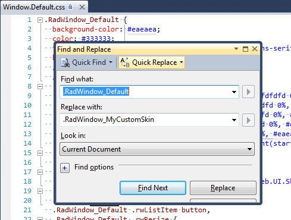

# Creating a Custom Lightweight Skin

## RadWindow Custom Skin with LightWeight RenderMode

Each of the controls included in the **Telerik® UI for ASP.NET Ajax** suite is styled with two CSS files that are loaded in a certain order. The first one **[ControlName].css** , also called base stylesheet, contains CSS properties and values that are common for all skins, i.e it is layout-specific, not skin-specific. These are CSS float, padding, margin, font-size, font-family, etc. In the general case, when creating a custom skin for a control this file should not be edited, unless the custom skin needs different sizes, padding and / or margins. 

The second file represents the actual skin of the control, and its name consists of the control name plus the skin name, e.g. - **Window.Default.css**. Upon creating a custom skin for the control, one should edit that particular file, as it contains skin-specific CSS properties, and references to images, colors, borders and backgrounds. 

Since Q2 2013 RadWindow has a LightWeight render mode, which uses semantically structured HTML and CSS3 for shadows, rounded corners and gradients. Overall, the skinning method is the same as for the Classic mode. The difference is that now there is one common sprite for all Light-Weighted controls called **radActionsSprite.png**. The sprite is placed in the **[SkinName]\Common** folder, e.g.: **[ControlsInstallationFolder]\Skins\Default\Common\radActionsSprite.png**

## Creating RadWindow LightWeight Skin from Existing One

1. In your project, create a new directory named **Skins**; 

2. In the **Skins** folder if you already have some custom skin, most probably you have already a folder named: **MyCustomSkin** if you dont  create one; 

3. In the **Skins** folder create a new folder named: **MyCustomSkinLite** - this is the place where your Light-Weight custom skins CSS will be placed; 

4. Go to **[ControlsInstallationFolder]\Skins\DefaultLite** and copy **Window.Default.css** in your **MyCustomSkinLite** folder; 

5. Go to **[ControlsInstallationFolder]\Skins\Default** and copy **Common** folder in your **MyCustomSkin** folder; 

6. Rename **Window.Default.css** to **Window.MyCustomSkin.css**; 

7. When you are finished you should have the following folder structure in your project:
	* **Skins/MyCustomSkin/Common/**- containing several sprites; 
	* **Skins/MyCustomSkinLite/Window.MyCustomSkin.css**. 


8. In order to support multiple skins of **RadWindow** on a single page, the wrapping skin-specific class is coined by the name of the control, plus underscore ("_") plus SkinName, i.e. **.RadWindow_Default**, so in order to create a custom skin out of the Default skin, we should rename all occurrences of **"RadWindow_Default"** in **Window.MyCustomSkin.css** to **"RadWindow_MyCustomSkin"** as shown below: 

	

9. Add a new server declaration of **RadWindow** on your page, and set **Skin="MyCustomSkin"** and **EnableEmbeddedSkins="false"**: 

	**ASP.NET**
	
		<telerik:RadWindow ID="RadWindow1" runat="server"  EnableEmbeddedSkins="false" Skin="MyCustomSkin" />
		
10. Register **Window.MyCustomSkin.css** in the head section of your web page. In order to have the CSS applied correctly, the base stylesheet should come first in the DOM:

	**ASP.NET**
	
		<link href="Skins/MyCustomSkin/Window.MyCustomSkin.css" rel="stylesheet" type="text/css" />
		
1. Make sure the path to the files is correct; otherwise the skin will not apply;

2. To complete the customization, you will need to change the common sprite color according to your needs. Open **[ControlsInstallationFolder]\Skins\Default\radActionsSprite.png** and edit it as required. 

3. Reload the page, and if the steps 1-12 have been followed correctly, you will see **RadWindow** running a custom Default skin set as an external resource. 

## RadWindow LightWeight Custom Skin Example

Below is shown how to modify the CSS in order not only to change some colors and background colors, but also some base layout settings such as font size, element height, border-radius etc.

````ASP.NET
<!DOCTYPE html PUBLIC "-//W3C//DTD XHTML 1.0 Transitional//EN" "http://www.w3.org/TR/xhtml1/DTD/xhtml1-transitional.dtd">
<html xmlns="http://www.w3.org/1999/xhtml">
<head runat="server">
    <title></title>
    <style type="text/css">
        .RadWindow.RadWindow_MyCustomSkin.rwRoundedCorner {
            border-radius: 8px;
        }

        .RadWindow.RadWindow_MyCustomSkin.rwRoundedCorner .rwTitleBar {
            border-radius: 8px 8px 0 0;
        }

        .RadWindow.RadWindow_MyCustomSkin {
            border-width: 2px; /* Change border width */
            background-color: #f7cefa; /* Change Content base background color */
            border-color: #450349; /* Change border color */
            color: #333333;
            font: 16px Tahoma, Verdana, sans-serif;
        }

        .RadWindow.RadWindow_MyCustomSkin .rwTitleBar {
            height: 32px; /* Change TitleBar height */
            border-bottom-color: #450349; /* sets color of the bottom border titlebar  */
            background-image: -webkit-linear-gradient(top, #840c83 0%, #f7cefa 100%); /* CSS gradient for the title bar, applied from top to bottom - webkit */
            background-image: -moz-linear-gradient(top, #840c83 0%, #f7cefa 100%); /* CSS gradient for the title bar, applied from top to bottom - firefox */
            background-image: -ms-linear-gradient(top, #840c83 0%, #f7cefa 100%); /* CSS gradient for the title bar, applied from top to bottom - IE10+ */
            background-image: -o-linear-gradient(top, #840c83 0%, #f7cefa 100%); /* CSS gradient for the title bar, applied from top to bottom - Opera */
            background-image: linear-gradient(top, #840c83 0%, #f7cefa 100%); /* CSS gradient for the title bar, applied from top to bottom - native CSS3 rule */
            filter: progid:DXImageTransform.Microsoft.gradient(startColorstr='#840c83', endColorstr='#f7cefa',GradientType=0 ); /* Older IE */
        }

        .RadWindow.RadWindow_MyCustomSkin .rwTitleWrapper .rwTitle {
            color: #fff; /* Should be specified in order to be different than the Content text color */
            font-family: Verdana, serif; /* Change font family */
            font-size: 18px; /* Change font size */
            height: 24px;  /* Change height */
            line-height: 24px; /* Change line-height to position the title in the middle if you have changed font size already */
        }

        .RadWindow.RadWindow_MyCustomSkin .rwContent {
            border-bottom-width: 0; /* Change content border-bottom width */
            background-color: #3b043f; /* Change content background color */
            color: #fff; /* Change content font color */
        }

    </style>
</head>
<body>
    <form id="form1" runat="server">
    <asp:ScriptManager ID="sm1" runat="server" />
    <telerik:RadWindow ID="rd1" runat="server" VisibleOnPageLoad="true" Width="400" Height="300"
        RenderMode="Lightweight" Top="100" Left="20" Title="Dock Title" EnableEmbeddedSkins="false"
        Skin="MyCustomSkin" EnableRoundedCorners="true">
        <ContentTemplate>
            Lorem ipsum dolor sit amet, consectetur adipiscing elit. Suspendisse in enim nibh.
            Etiam laoreet eros sit amet felis cursus faucibus.
        </ContentTemplate>
    </telerik:RadWindow>
    </form>
</body>
</html>
````


## See Also

 * [Telerik ThemeBuilder for ASP.NET AJAX](http://themebuilder.telerik.com/)


