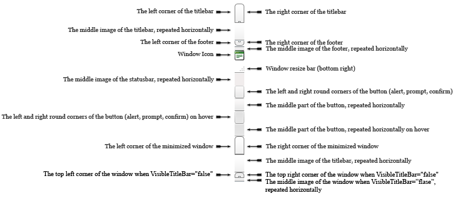

# RadWindow CSS Classes and Their Use

## RadWindow for ASP.NET AJAX CSS Classes and Their Use

## Abstract

Each of the controls included in the Telerik® UI for ASP.NET AJAX suite is styled with two CSS files that are loaded in a certain order. The first one - ControlName.css, also called **base stylesheet** contains CSS properties and values that are common for all skins, i.e it is layout-specific, not skin-specific. These are CSS float, padding, margin, font-size, font-family, etc. In the general case, when creating a custom skin for a control this file should not be edited, unless the custom skin needs different sizes, paddings or margins.

The second file represents the actual skin of the control, and its name consists of the control name plus the skin name, i.e - Window.Default.css. Upon creating a custom skin for the control, one should edit that particular file, as it contains skin-specific CSS properties, and references to images, colors, borders and backgrounds.

## Creating a Custom Skin for RadWindow for ASP.NET AJAX from an Existing One

Getting and Renaming Files and CSS Classes

In order to explain better the CSS classes of RadWindow, we will use both Window.css and Window.SkinName.css as external resources. We will modify an existing skin of RadWindow. Follow these steps to register an external skin for RadWindow for ASP.NET AJAX before editing any CSS:

1. In your project, create a new directory named **Skins**

1. In the skins folder create a new directory **MyCustomSkin**.

1. Go to **~/[ControlsInstallationFolder]/Skins** and copy **Window.css** in your **Skins** folder

1. Go to **~/[ControlsInstallationFolder]/Skins/Default** and copy **Window.Default.css** and the **Skins/Default/Window** folder in your **Skins** folder.

1. Rename Window.**Default**.css to Window.**MyCustomSkin**.css and the folder **Default** to **MyCustomSkin**.

1. When you are finished you should have: Skins/Window.css, Skins/MyCustomSkin/Window.MyCustomSkin.css and Skins/MyCustomSkin/Window. The last folder contains the images for MyCustomSkin.

1. In order to support multiple skins of RadWindow on a single page, the wrapping skin-specific class is coined by the name of the control, RadWindow plus underscore ("_") plus SkinName, i.e **.RadWindow_Default**, so in order to create a custom skin out of the Default skin, we should rename all occurrences of "**Default**" in Window.MyCustomSkin.css to "**MyCustomSkin**" as shown below:

	

1. Put a new server declaration of RadWindow on your page, and set **Skin="MyCustomSkin", EnableEmbeddedSkins="false"** and **EnableEmbeddedBasestylesheet="false"**:

	**ASP.NET**
	
		<telerik:RadWindow RenderMode="Lightweight" ID="RadWindow1" runat="server" NavigateUrl="http://www.google.com"
			Title="Google" Skin="MyCustomSkin" EnableEmbeddedSkins="false" EnableEmbeddedBaseStylesheet="false"
			VisibleOnPageLoad="true">
		</telerik:RadWindow>

1. Register **Window.css** and **Window.MyCustomSkin.css** in the <head>...</head> section of your web page. In order to have the CSS applied correctly, the base stylesheet should come first in the DOM:

	**ASP.NET**
	
		<link rel="stylesheet" type="text/css" href="Skins/Window.css"></link>
		<link rel="stylesheet" type="text/css" href="Skins/MyCustomSkin/Window.MyCustomSkin.css"></link>

1. Make sure the path to the files is correct, otherwise the skin will not apply.

1. Reload the page, and if the steps 0-9 have been followed correctly, you will see RadWindow running a custom Default skin set as an external resource.

Explanation of the CSS Classes

Main CSS Classes

| CSS Class | Description |
| ------ | ------ |
|.RadWindow table|RadWindow’s TABLE common settings|
|.RadWindow table td|RadWindow’s TD common settings|
|.RadWindow .rwTopResize|RadWindow’s top resize handle|
|.RadWindow .rwStatusbarRow .rwCorner|RadWindow’s corner|
|.RadWindow .rwStatusbarRow .rwBodyLeft|RadWindow’s status bar left side|
|.RadWindow .rwStatusbarRow .rwBodyRight|RadWindow’s status bar right side|
|.RadWindow .rwStatusbar|RadWindow’s status bar|
|.RadWindow .rwStatusbar div|RadWindow’s bottom corner resize handle|
|.RadWindow .rwCorner|RadWindow’s corners|
|.RadWindow .rwTopLeft|RadWindow’s top left corner|
|.RadWindow .rwTopRight|RadWindow’s top right corner|
|.RadWindow .rwTitlebar|RadWindow’s title bar|
|.RadWindow .rwFooterLeft|RadWindow’s footer left corner|
|.RadWindow .rwFooterRight|RadWindow’s footer right corner|
|.RadWindow .rwFooterCenter|RadWindow’s footer center|
|.RadWindow .rwBodyLeft|RadWindow’s left part, between status and title bar|
|.RadWindow .rwBodyRight|RadWindow’s right part, between status and title bar|
|.RadWindow .rwTopLeft|RadWindow’s top left|
|.RadWindow .rwTopRight|RadWindow’s top right|
|.RadWindow table .rwTitlebar|RadWindow’s table title bar|
|.RadWindow .rwFooterLeft|RadWindow’s footer left|
|.RadWindow .rwFooterRight|RadWindow’s footer right|
|.RadWindow .rwFooterCenter|RadWindow’s footer center|
|.RadWindow .rwTitlebarControls|RadWindow’s title bar controls|
|.RadWindow .rwWindowContent|RadWindow’s content|
|.RadWindow td.rwLoading|RadWindow’s loading image|
|.RadWindow .rwStatusbar .rwLoading|RadWindow’s status bar loading image|
|.RadWindow td.rwStatusbar input|RadWindow’s status bar input|
|.RadWindow .rwControlButtons|RadWindow’s control buttons|
|.RadWindow .rwControlButtons li|RadWindow’s control buttons LI element|
|.RadWindow .rwControlButtons a|RadWindow’s control buttons link normal state|
|.RadWindow .rwControlButtons span|RadWindow’s control buttons SPAN|
|.RadWindow .rwReloadButton|RadWindow’s reload button normal state|
|.RadWindow .rwReloadButton:hover|RadWindow’s reload button hover state|
|.RadWindow .rwPinButton|RadWindow’s pin button normal state|
|.RadWindow .rwPinButton:hover|RadWindow’s pin button hover state|
|.RadWindow .rwPinButton.on|RadWindow’s active pin button normal state|
|.RadWindow .rwPinButton.on:hover|RadWindow’s active pin button hover state|
|.RadWindow .rwMinimizeButton|RadWindow’s minimize button normal state|
|.RadWindow .rwMinimizeButton:hover|RadWindow’s minimize button hover state|
|.RadWindow .rwMaximizeButton|RadWindow’s maximize button normal state|
|.RadWindow .rwMaximizeButton:hover|RadWindow’s maximize button hover state|
|.RadWindow .rwCloseButton|RadWindow’s close button normal state|
|.RadWindow .rwCloseButton:hover|RadWindow’s close button hover state|
|.RadWindow .rwIcon|RadWindow’s icon|
|.RadWindow em|RadWindow’s EM element|
|.RadWindow_rtl .rwControlButtons|RadWindow’s right to left control buttons|
|div.RadWindow_rtl .rwControlButtons li|RadWindow’s right to left control LI element|
|.RadWindow.rwInactiveWindow .rwTitlebarControls|RadWindow’s inactive window title bar controls|
|.RadWindow .rwDialogPopup|RadWindow’s dialog popup|
|.rwDialogPopup .rwPopupButton|RadWindow’s dialog popup popup button normal state|
|.rwDialogPopup .rwPopupButton:focus|RadWindow’s dialog popup popup button focus state|
|.rwDialogPopup .rwPopupButton:active|RadWindow’s dialog popup popup button active state|
|.rwDialogPopup .rwPopupButton span|RadWindow’s dialog popup popup button SPAN|
|.RadWindow .rwControlButtons a|RadWindow’s control buttons link normal state|
|html:first-child .RadWindow ul|RadWindow’s first RW UL|
|.RadWindow .rwDialogText|RadWindow’s dialog text|
|.RadWindow.rwMinimizedWindow .rwPinButton|RadWindow’s minimized window pin button|
|.RadWindow.rwMinimizedWindow .rwReloadButton|RadWindow’s minimized window reload button|
|.RadWindow.rwMinimizedWindow .rwMaximizeButton|RadWindow’s minimized window maximize button|
|.RadWindow.rwMinimizedWindow .rwTopResize|RadWindow’s minimized window top resize|
|.RadWindow .rwDialogInput|RadWindow’s dialog input|
|.RadWindow .rwWindowContent .radconfirm|RadWindow’s content confirm dialog|
|.RadWindow .rwWindowContent .radalert|RadWindow’s content alert|
|.RadWindow .rwWindowContent .radprompt|RadWindow’s content prompt|
|.RadWindow .rwPopupButton|RadWindow’s popup button|
|.RadWindow .rwPopupButton span|RadWindow’s popup button span|
|.RadWindow .rwWindowContent .rwPopupButton .rwOuterSpan|RadWindow’s content popup button outer span|
|.RadWindow .rwWindowContent .rwPopupButton .rwInnerSpan|RadWindow’s content popup button inner span|
|.RadWindow .rwWindowContent .rwPopupButton:hover|RadWindow’s content popup button hover state|
|.RadWindow .rwWindowContent .rwPopupButton:hover .rwOuterSpan|RadWindow’s content popup button hover state outer span|
|.RadWindow .rwWindowContent .rwPopupButton:hover .rwInnerSpan|RadWindow’s content popup button hover state inner span|
|.RadWindow .rwStatusbarRow .rwBodyLeft|RadWindow’s status bar row body left|
|.RadWindow .rwStatusbarRow .rwBodyRight|RadWindow’s status bar body right|
|.RadWindow.rwMinimizedWindow|RadWindow’s minimized window|
|.RadWindow.rwMinimizedWindow .rwContentRow|RadWindow’s minimized window content row|
|.RadWindow.rwMinimizedWindow .rwStatusbarRow|RadWindow’s minimized window status bar row|
|.RadWindow.rwMinimizedWindow table.rwTitlebarControls|RadWindow’s minimized window title bar controls|
|.RadWindow.rwMinimizedWindow .rwControlButtons|RadWindow’s minimized window control buttons|
|.RadWindow.rwMinimizedWindow em|RadWindow’s minimized window EM element|
|.RadWindow.rwInactiveWindow .rwCorner|RadWindow’s minimized window corners|
|.RadWindow.rwMinimizedWindow .rwCorner.rwTopLeft|RadWindow’s minimized window top left corner|
|.RadWindow.rwMinimizedWindow .rwCorner.rwTopRight|RadWindow’s minimized window top right corner|
|.RadWindow.rwMinimizedWindow .rwTitlebar|RadWindow’s minimized window title bar|
|.RadWindow.rwInactiveWindow .rwFooterCenter|RadWindow’s minimized window footer center|
|.RadWindow .rwShadow .rwTopLeft|Styles Shadowed Window top left corner|
|.RadWindow .rwShadow .rwTopRight|Styles Shadowed Window top right corner|
|.RadWindow .rwShadow .rwTopResize|Styles Shadowed Window top resize|
|.RadWindow .rwShadow .rwTitlebar|Styles Shadowed Window title bar|
|.RadWindow .rwShadow .rwFooterLeft|Styles Shadowed Window left footer corner|
|.RadWindow .rwShadow .rwFooterRight|Styles Shadowed Window right footer corner|
|.RadWindow .rwShadow .rwFooterCenter|Styles Shadowed Window footer center|
|.RadWindow .rwShadow .rwBodyLeft|Styles Shadowed Window left side|
|.RadWindow .rwShadow .rwBodyRight|Styles Shadowed Window right side|
|.RadWindow .rwShadow em|Styles Shadowed Window Title|
|.RadWindow .rwShadow .rwIcon|Styles Shadowed Window Title bar icon|
|.RadWindow.rwMinimizedWindowShadow|Styles Shadowed Window Minimized state|
|.RadWindow.rwMinimizedWindowShadow .rwTable|Styles Shadowed Window Minimized state table|
|.RadWindow.rwMinimizedWindow .rwShadow .rwCorner.rwTopLeft|Styles Shadowed Window Minimized top left corner|
|.RadWindow.rwMinimizedWindow .rwShadow .rwCorner.rwTopRight|Styles Shadowed Window Minimized top right corner|
|.RadWindow.rwMinimizedWindow .rwShadow .rwTitlebar|Styles Shadowed Window Minimized Title bar|
|.RadWindow.rwMinimizedWindow .rwShadow .rwFooterLeft|Styles Shadowed Window Minimized bottom left corner|
|.RadWindow.rwMinimizedWindow .rwShadow .rwFooterCenter|Styles Shadowed Window Minimized footer center|
|.RadWindow.rwMinimizedWindow .rwShadow .rwFooterRight|Styles Shadowed Window Minimized bottom right corner|
|.RadWindow.rwMinimizedWindowShadow .rwShadow .rwTitlebarControls|Styles Shadowed Window Minimized state title bar controls|
|.RadWindow.rwMinimizedWindowShadow .rwShadow.rwTitlebarControls .rwControlButtons .rwPinButton,.RadWindow.rwMinimizedWindowShadow .rwShadow.rwTitlebarControls .rwControlButtons .rwReloadButton,.RadWindow.rwMinimizedWindowShadow .rwShadow.rwTitlebarControls .rwControlButtons .rwMaximizeButton,.RadWindow.rwMinimizedWindowShadow .rwShadow.rwContentRow,.RadWindow.rwMinimizedWindowShadow .rwShadow.rwStatusbarRow|Styles the buttons (Pin, Reload, Maximize) to be display: none when the Shadowed window is minimized and also content row and status bar|
|div.RadWindow_rtl table.rwShadow .rwControlButtons li|Styles Shadowed Window right to left support control buttons LI element|
|div.RadWindow.rwNoTitleBar table.rwShadow td.rwTopLeft|Styles Shadowed Window No title bar state top left corner|
|div.RadWindow.rwNoTitleBar table.rwShadow td.rwTitlebar|Styles Shadowed Window No title bar state title bar|
|div.RadWindow.rwNoTitleBar table.rwShadow td.rwTopRight|Styles Shadowed Window No title bar state top right corner|
|div.RadWindow.rwNoTitleBar.rwInactiveWindow table.rwShadow td.rwTopLeft|Styles Inactive Shadowed Window No title bar state top left corner|
|div.RadWindow.rwNoTitleBar.rwInactiveWindow table.rwShadow td.rwTitlebar|Styles Inactive Shadowed Window No title bar state title bar|
|div.RadWindow.rwNoTitleBar.rwInactiveWindow table.rwShadow td.rwTopRight|Styles Inactive Shadowed Window No title bar state top right corner|
|div.RadWindow.rwNoTitleBar.rwInactiveWindow table.rwShadow td.rwTopLeft|Styles top left shadowed Window corner when VisibleTitlebar is set to false|
|div.RadWindow.rwNoTitleBar.rwInactiveWindow table.rwShadow td.rwTitlebar|Styles Titlebar shadowed Window when VisibleTitlebar is set to false|
|div.RadWindow.rwNoTitleBar.rwInactiveWindow table.rwShadow td.rwTopRight|Styles top right shadowed Window corner when VisibleTitlebar is set to false|

CSS for window's top corners when visible title bar is set to false

| CSS Class | Description |
| ------ | ------ |
|div.RadWindow.rwNoTitleBar tr.rwTitleRow td.rwTopLeft|RadWindow’s title row top left|
|div.RadWindow.rwNoTitleBar tr.rwTitleRow td.rwTitlebar|RadWindow’s title row title bar|
|div.RadWindow.rwNoTitleBar tr.rwTitleRow td.rwTopRight|RadWindow’s title row top right|
|div.RadWindow.rwNoTitleBar div.rwTopResize|RadWindow’s title bar top resize|

Skin Specific Selectors

| CSS Class | Description |
| ------ | ------ |
|div.RadWindow_SkinName a.rwCancel|RadWindow’s cancel button|
|div.RadWindow_ SkinName a.rwCancel span|RadWindow’s cancel button SPAN|
|div.RadWindow_Default a.rwCancel span span|RadWindow’s cancel button SPAN SPAN|
|.RadWindow_SkinName .rwShadow .rwTopLeft,.RadWindow_SkinName.rwShadow .rwTopRight,.RadWindow_SkinName.rwShadow .rwTitlebar,.RadWindow_SkinName.rwShadow .rwFooterLeft,.RadWindow_SkinName.rwShadow .rwFooterRight,.RadWindow_SkinName.rwShadow .rwFooterCenter,.RadWindow_SkinName.rwShadow .rwTopResize,.RadWindow_SkinName.rwShadow .rwStatusbar div,.RadWindow_SkinName.rwShadow .rwStatusbar,.RadWindow_SkinName.rwShadow .rwPopupButton,.RadWindow_SkinName.rwShadow .rwPopupButton span,.RadWindow_SkinName.rwShadow .rwBodyLeft,.RadWindow_SkinName.rwShadow .rwBodyRight,.RadWindow_SkinName.rwShadow .rwStatusbarRow .rwBodyLeft,.RadWindow_SkinName.rwShadow .rwStatusbarRow .rwBodyRight|Specifies which elements are using the horizontal background image sprite for the Shadowed Window|
|.RadWindow_SkinName .rwShadow .rwBodyLeft,.RadWindow_SkinName .rwShadow .rwBodyRight,.RadWindow_SkinName .rwShadow .rwStatusbarRow .rwBodyLeft,.RadWindow_SkinName .rwShadow .rwStatusbarRow .rwBodyRight|Specifies which elements are using the Vertical background image sprite for the Shadowed Window|
|.RadWindow_SkinName .rwShadow .rwControlButtons|Specifies Control buttons position for each skin, as there are little differences between skins, because of the buttons designs|
|.RadWindow_SkinName.rwMinimizedWindowShadow .rwShadow .rwControlButtons|Specifies Control buttons position when Window is minimized for each skin as there are little differences between skins because of the buttons designs|
|.RadWindow_SkinName.rwMinimizedWindowShadow .rwShadow em|Specifies Shadowed Window title position|
|.RadWindow_SkinName .rwShadow .rwControlButtons li|Styles Shadowed Window control buttons LI element|
|.RadWindow_SkinName .rwShadow .rwControlButtons a|Styles Shadowed Window control buttons Anchor element|
|.rwInactiveWindow .rwShadow .rwTopLeft,.rwInactiveWindow .rwShadow .rwTopRight,.rwInactiveWindow .rwShadow .rwTitlebar,.rwInactiveWindow .rwShadow .rwFooterLeft,.rwInactiveWindow .rwShadow .rwFooterRight,.rwInactiveWindow .rwShadow .rwFooterCenter,.rwInactiveWindow .rwShadow .rwTopResize,.rwInactiveWindow .rwShadow .rwStatusbar div,.rwInactiveWindow .rwShadow .rwStatusbar,.rwInactiveWindow .rwShadow .rwPopupButton,.rwInactiveWindow .rwShadow .rwPopupButton span,.rwInactiveWindow .rwShadow.rwMinimizedWindow .rwCorner,.RadWindow_SkinName.rwNoTitleBar.rwInactiveWindow .rwShadow .rwTopLeft,.RadWindow_SkinName.rwNoTitleBar.rwInactiveWindow .rwShadow .rwTitlebar,.RadWindow_SkinName.rwNoTitleBar.rwInactiveWindow .rwShadow .rwTopRight,.RadWindow_SkinName.rwNoTitleBar.rwInactiveWindow .rwShadow .rwFooterLeft,.RadWindow_SkinName.rwNoTitleBar.rwInactiveWindow .rwShadow .rwFooterCenter,.RadWindow_SkinName.rwNoTitleBar.rwInactiveWindow .rwShadow .rwFooterRight|Specifies which elements are using the horizontal back-ground image sprite for the Shadowed Window Inactive state and when VisibleTitlebar is set to false state|
|.rwInactiveWindow .rwShadow .rwBodyLeft,.rwInactiveWindow .rwShadow .rwBodyRight,.rwInactiveWindow .rwShadow .rwStatusbarRow .rwCorner,.RadWindow_SkinName.rwNoTitleBar.rwInactiveWindow .rwShadow .rwBodyLeft,.RadWindow_SkinName.rwNoTitleBar.rwInactiveWindow .rwShadow .rwBodyRight|Styles Shadowed Inactive Window with or without visible TitleBar|

The Skin Stylesheet - Window.MyCustomSkin.css

Each skin of RadWindow consists of three [image sprites](http://www.alistapart.com/articles/sprites/), that are contained in the Skins/SkinName/Window folder. These are:

1. CommandButtonSprites.gif - the images for RadWindow's buttons, as well as their hover states:

	
	
	On the first row is the normal state of the buttons, on the second - the hovered state. In the CSS they are selected from the sprite via the [background-position](https://www.w3schools.com/css/pr_background-position.asp) property.

1. WindowHorizontalSprites.gif* - the images for RadWindow's horizontal parts and the images for the "OK" and "Cancel" buttons of RadAlert, RadPrompt and RadConfirm:
	
	* - for this example WindowHorizontalSprites.gif has been rotated 90° CCW

1. WindowVerticalSprites.gif - the images for the vertical sides of RadWindow	
	
	

1. Classes that use WindowHorizontalSprites.gif. Their use has already been explained in **The Base Stylesheet - Window.css**

	**CSS**
	        
		.RadWindow_MyCustomSkin .rwTopLeft, 
		.RadWindow_MyCustomSkin .rwTopRight, 
		.RadWindow_MyCustomSkin .rwTitlebar, 
		.RadWindow_MyCustomSkin .rwFooterLeft, 
		.RadWindow_MyCustomSkin .rwFooterRight, 
		.RadWindow_MyCustomSkin .rwFooterCenter, 
		.RadWindow_MyCustomSkin .rwTopResize, 
		.RadWindow_MyCustomSkin .rwStatusbar div, 
		.RadWindow_MyCustomSkin .rwStatusbar, 
		.RadWindow_MyCustomSkin .rwPopupButton, 
		.RadWindow_MyCustomSkin .rwPopupButton span, 
		.RadWindow_MyCustomSkin.rwMinimizedWindow .rwCorner
		{
			background-image: url('Window/WindowHorizontalSprites.gif');
		}

1. Classes that use WindowVerticalSprites.gif. Their use has already been explained in **The Base Stylesheet - Window.css**

	**CSS**
	        
		.RadWindow_MyCustomSkin .rwBodyLeft, .RadWindow_MyCustomSkin .rwBodyRight, .RadWindow_MyCustomSkin .rwStatusbarRow .rwCorner
		{
			background-image: url('Window/WindowVerticalSprites.gif');
		}

1. RadWindow Statusbar Input

	**CSS**
	        
		.RadWindow_MyCustomSkin .rwStatusbar input
		{
			background-color: #f7f3e9;
		}

1. Classes that use CommandButtonSprites.gif. Their use has already been explained in **The Base Stylesheet - Window.css**

	**CSS**	        

		.RadWindow_MyCustomSkin .rwControlButtons a
		{
			background-image: url('Window/CommandButtonSprites.gif');
		}

1. RadWindow Icon

	**CSS**
	        
		.RadWindow_MyCustomSkin a.rwIcon
		{
			background-image: url('Window/WindowHorizontalSprites.gif');
		}

1. RadWindow Titlebar Text

	**CSS**
	        
		div.RadWindow_MyCustomSkin .rwTitlebarControls em
		{
			color: black;
		}
	        
Understanding the Image Sprites

Below are visual schemes of the image sprites that are used to skin RadWindow.

WindowHorizontalSprites.gif

WindowVerticalSprites.gif

CommandButtonSprites.gif

Modifying the Image Sprites to Achieve Totally New Looks for the Skin

Explained below is a simple method for modifying the image sprites of RadWindow with [Adobe© PhotoShop](http://adobe.com) to achieve new looks without creating a new design.

1. Drag CommandButtonSprites.gif, WindowHorizontalSprites.gif and WindowVerticalSprites.gif in [Adobe© PhotoShop](http://adobe.com)

1. From the menu bar select **Image » Mode » RGB Color** to prepare the images for editing (convert from optimized **Indexed Color** to **RGB Color**):

	

1. Press **Set Foreground Color** in PhotoShop's toolbox to invoke the color picker dialog:

	

1. Select a color that you like from the color dialog and then close it:

	

1. Choose the first image you will modify, for example WindowHorizontalSprites.gif, and select **Image » Adjustments Hue » / Saturation to open the Hue / Saturation** dialog of [Adobe© PhotoShop](http://adobe.com):

	

1. Check the **colorize** checkbox in the Hue / Saturation dialog, and the image you have selected will be immediately colorized in the hue you have selected from the toolbox:

	
	
	You may then play with the Hue, Saturation and Lightness sliders to fine tune or further modify the image. Make sure you memorize the values of the sliders, as you will need to add the same settings to all three images in order to achieve consistent looks

1. Press "OK" when you are finished

1. Select Image **Image » Mode » Indexed Color** to flatten the layers of the image

1. Save and close the image

1. Repeat Steps 5 - 9 for each of the remaining images

1. After you are over and done with this, save your work and reload the page. You will have a brand new skin based on [Telerik](https://www.telerik.com)'s Default skin of RadWindow.

	

	
