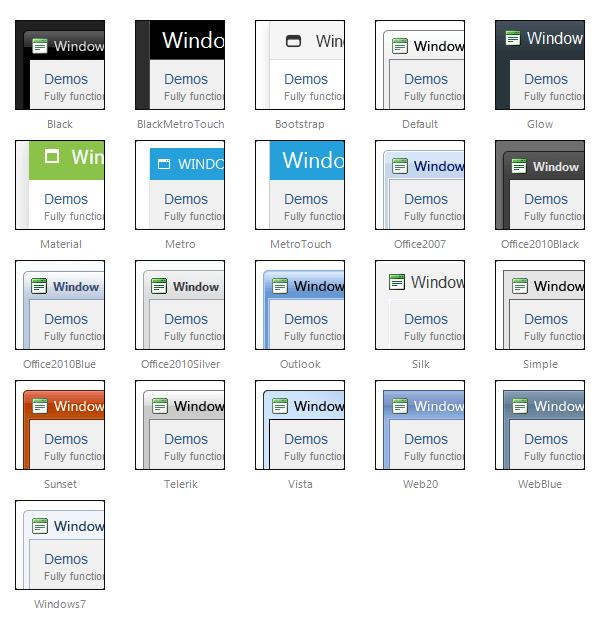

# Skins

Skins control the overall look and feel of a **RadWindow** object. By using Skins consistently, you can make your windows fit in with the design of the rest of a Web site, increasing usability and attractiveness. If you use the RadWindow versions of the Alert, Prompt, and Confirm dialogs, you can use the same skin with these dialogs and have them blend in more harmoniously with your Web site than the built-in browser dialogs do.

Specify the Skin to use by setting the **Skin** property of the **RadWindowManager** object. All windows that the **RadWindowManager** controls then inherit that Skin, including the Alert, Prompt, and Confirm dialogs. You can override this default Skin by setting the **Skin** property on an individual **RadWindow** object.

There is a number of built-in skins for the RadWindow control:

 

 @[template - Material skin is available only in Lightweight mode](/_templates/common/skins-notes.md#material-only-in-lightweight) 

## See Also

 * [Controlling Visual Appearance](https://www.telerik.com/help/aspnet-ajax/controllingvisualappearance.html)
 * [Telerik ThemeBuilder for ASP.NET AJAX](https://themebuilder.telerik.com/)

