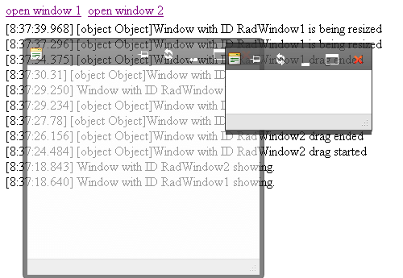

# Events Overview

The **RadWindow** control offers many client-side events that you can use together with its	[client-side API]() to control its behavior.	These events are set through a number of properties whose value is the name of a JavaScript function that executes when the specific client-side event occurs.	The available events are are listed below. You can also [add and remove event handlers dynamically with JavaScript]().

>tip When the JavaScript function is called, it is supplied with two arguments: the sender (i.e., the RadWindow instance that fired the event), and an event arguments object(which may or may not contain methods, depending on the event).

* **[OnClientActivate]()**—called when the window becomes the active window.
* **[OnClientAutoSizeEnd]()**—fires when a RadWindow's autosize has finished.
* **[OnClientBeforeClose]()**—called before the RadWindow is being closed. Can be used to cancel the closing via the set_cancel(shouldCancel)	method of the event arguments object.
* **[OnClientBeforeShow]()**—fires just before the RadWindow is shown. You can cancel the show of the RadWindow there.
* **[OnClientClose]()**—called after the window is closed. If an argument is passed to the close() method when it is called from JavaScript	you can obtain this object via the get_argument() method of the event arguments object. Useful in dialog scenarios when closing the RadWindow from its content page.
* **[OnClientCommand]()**—fires when the commands Pin, Reload, Minimize and Maximize are executed (when the user presses a titlebar button).	Its event arguments object provides the get_commandName() method which returns the name of the command that was just fired. It can also be cancelled via the `set_cancel(shouldCancel)` method.
* **[OnClientDragEnd]()**—called after a drag operation ends.
* **[OnClientDragStart]()**—called when the user starts dragging the window.
* **[OnClientPageLoad]()**—called when the page in the content window completes loading.
* **[OnClientResize]()**—fires when a RadWindow is being resized
* **[OnClientResizeEnd]()**—called after a resize operation ends.
* **[OnClientResizeStart]()**—called when the user starts resizing the window.
* **[OnClientShow]()**—called after the window is shown.

>note The Client-side events are raised in the page where the RadWindow's markup resides, regardless of the window object that initiated its opening. If you are [opening a RadWindow from within a RadWindow]() the second one's events can be directly consumed in the parent page, not in the first dialog. Therefore, event handlers should not be added dynamically in the context of the first dialog.

## Example

The following example illustrates how client-side events work.

1. Drag a **RadWindowManager** object from the toolbox onto your form.

1. Use the **Windows** property to bring up the [RadWindow Collection Editor]().

1. Add two **RadWindow** objects, giving them **ID** values of "RadWindow1" and "RadWindow2", respectively. Then Click Ok to close the editor.

1. Go to the source view, and add the following code to the markup of your page:

	**JavaScript**
	
		/**********************************************************
		Window Events
		**********************************************************/
		function OnClientCommand(sender, eventArgs)
		{
			logEvent("<strong>OnClientCommand</strong>: Command is " + eventArgs.get_commandName());
		}

		function OnClientResizeEnd(sender, eventArgs)
		{
			logEvent("<strong>OnClientResizeEnd</strong>: RadWindow is resize ended");
		}

		function OnClientResizeStart(sender, eventArgs)
		{
			logEvent("<strong>OnClientResizeEnd</strong>: RadWindow is resize started");
		}

		function OnClientDragStart(sender, eventArgs)
		{
			logEvent("<strong>OnClientDragStart</strong>: RadWindow drag started");
		}

		function OnClientDragEnd(sender, eventArgs)
		{
			logEvent("<strong>OnClientDragEnd</strong>: RadWindow drag ended");
		}

		function OnClientPageLoad(sender, eventArgs)
		{
			logEvent("<strong>OnClientPageLoad</strong>: RadWindow completed loading the page");
		}

		function OnClientActivate(sender, eventArgs)
		{
			//LogEvent("<strong>OnClientActivate</strong>: RadWindow is activated.");
		}

		function OnClientBeforeClose(sender, eventArgs)
		{
			logEvent("<strong>OnClientBeforeClose</strong>: RadWindow is closing.");
		}

		function OnClientclose(sender, eventArgs)
		{
			$get("Button1").disabled = false;
			var arg = eventArgs.get_argument();
			if (arg)
			{
				radalert("A custom argument was passed. Its value is: " + arg);
				logEvent("<strong>OnClientClose</strong>: The RadWindow is closed with an argument. The provided argument is:  " + arg);
			}
			else
			{
				logEvent("<strong>OnClientClose</strong>: RadWindow is closed");
			}
		}

		function OnClientshow(sender, eventArgs)
		{
			$get("Button1").disabled = true;
			logEvent("<strong>OnClientShow</strong>: RadWindow is shown.");
		}

		function OnClientBeforeShow(sender, eventArgs)
		{
			logEvent("<strong>OnClientBeforeShow</strong>: RadWindow is showing.");
		}

		function OnClientAutoSizeEnd(sender, eventArgs)
		{
			logEvent("<strong>OnClientAutoSizeEnd</strong>: RadWindow is autosized.");
		}
		/**********************************************************
		Helper
		**********************************************************/
		function LogEvent(eventString)
		{
			var d = new Date();
			var dateStr = d.getHours() + ":" + d.getMinutes() + ":" + d.getSeconds() + "." + d.getMilliseconds();
			document.getElementById("eventConsole").innerHTML = "[" + dateStr + "] " + eventString + " " + document.getElementById("eventConsole").innerHTML;
		}

	This markup first defines some JavaScript functions: a helper function called LogEvent which writes information about the event to a `
` element on the page (in the sample above its ID is "eventConsole") and a set of 12 event handlers (the OnClientResize would flood the console, this is why we leave it out), each of which takes two arguments and calls LogEvent to display information about the event. After the `<script>` section, the markup adds two links to the page for opening the windows, and a `
` section to display the information written by the `LogEvent` function.

1. Select the **RadWindowManager** object and set the following properties:
	* Set the **OnClientCommand** property to "OnClientCommand".
	* Set the **OnClientResizeStart** property to "OnClientResizeStart".
	* Set the **OnClientResizeEnd** property to "OnClientResizeEnd".
	* Set the **OnClientAutoSizeEnd** property to "OnClientAutoSizeEnd".
	* Set the **OnClientDragStart** property to "OnClientDragStart".
	* Set the **OnClientDragEnd** property to "OnClientDragEnd".
	* Set the **OnClientActivate** property to "OnClientActivate".
	* Set the **OnClientPageLoad** property to "OnClientPageLoad".
	* Set the **OnClientBeforeClose** property to "OnClientBeforeClose".
	* Set the **OnClientClose** property to "OnClientClose."
	* Set the **OnClientShow** property to "OnCLientShow".
	* Set the **OnClientBeforeShow** property to "OnClientBeforeShow".

1. Open the RadWindow Collection Editor again, and set the **OpenerElementId** property of RadWindow1 to "link1" and the **OpenerElementId** property of RadWindow2 to "link2".

1. Run the application. Play with the windows, clicking the links to open them, dragging them around, resizing them, minimizing, maximizing or pinning them, etc:

## See Also

 * [Setting Handlers by Using JavaScript]()

 * [Client Side Events demo (live Url)](https://demos.telerik.com/aspnet-ajax/Window/Examples/ClientSideEvents/DefaultCS.aspx)
