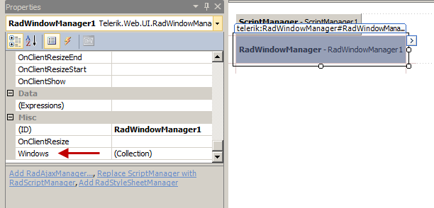

# Visual Configuration Manager

The visual Configuration Manager offered by the __RadWindowManager__ allows you to quickly and codelessly declare and setup the __RadWindows__ you are going to use on the page as well as the global [ Keyboard Shortcuts ]() for the __RadWindowManager__. It has two main sections - the __Windows collection__ editor and the __Shortcuts collections__ editor.

## Windows

The Windows Collection Editor for the __RadWindowManager__ allows you to easily add, remove and configure the windows of a __RadWindowManager__ control. When you are in this mode you add or remove RadWindow instances from the collection and you can also reorder them in the list. Once you select an item from the collection the right-hand side pane shows the properties of this RadWindow where you can configure it in great detail:

* Click the __Add__ button to append a new __RadWindow__to the collection.

* Use the up and down arrow buttons to rearrange the windows in the collection.

* Select a window and click the __Remove__button to delete it from the list.

* Select individual windows to change properties for the specific window.

Some important properties to notice in __RadWindow__are:

* __Behaviors__: This lists the possible ways a user can interact with the window, and determines what icons appear on the title bar. __Behaviors__ can include any or all of the following:Resize, Minimize, Close, Pin, Maximize, Move, Reload.

* __InitialBehaviors__: This lets you initialize the behavior of the window when it first appears, letting you have a window start up minimized, maximized, or pinned.

* __VisibleOnPageLoad:__ This controls whether the window appears when the web page first loads.

* __OffsetElementID, Left, Top:__These properties [ control the position where the window appears ]().

* __Modal__: This controls whether the window appears as a modal dialog. When the window is modal, the positioning properties (__OffsetElementId__, __Left__, and __Top__) have no effect and it is always centered.

* __VisibleStatusBar, VisibleTitleBar__: these properties control whether the window contains a status bar or title bar.

* __OpenerElementID__: This is the client-side ID of a user control that causes the window to appear when the user clicks it.

* __NavigateUrl__: This provides the URL of the content to appear in the window's content area.

* __Height, Width__: these control the size of the window.

* __MinimizeZoneID__: This specifies a control where the minimized image of the window is lodged.

* __OnClientCommand__, __OnClientDragEnd__, __OnClientDragStart__, __OnClientResize__, __OnClientResizeStart__, __OnClientResizeEnd__, __OnClientActivate__, __OnClientBeforeShow__, __OnClientShow__, __OnClientBeforeClose__, __OnClientClose__, __OnClientPageLoad__ and __OnClientAutoSizeEnd__. These [client-side events]() let you assign a JavaScript function that executes on the client side in response to various events.

* __DestroyOnClose__: This lets you override the default caching of __RadWindow__ instances, so that a new window is created every time the window is shown.

>note Note that if you destroy a __RadWindow__ , you will not be able to open the same RadWindow again - a new __RadWindow__ with default values will be opened instead.
>

* __ReloadOnShow__: This forces the browser to reload the content of the window every time it is shown.

Alternatively, you can also showthe Properties window for the __RadWindowManager__ and find the __Windows__ property. It represents the same collection so you can edit it via the ellipsis button:

This will show a simpler collection editor that you can use to add/edit windows as shown above:

## Shortcuts

In the same manner in which you can add windows to the Windows collection you can also add, remove, reorder the [Keyboard Shortcuts]() through which the __RadWindowManager__ can receive commands. You van set the shortcut combination in the properties pane as well:

* Click the __Add__ button to append a new __Shortcut__ to the collection.

* Use the up and down arrow buttons to rearrange the items in the collection.

* Select a shortcut and click the __Remove__ button to delete it from the list.

* You can set its __CommandName__ and __Shortcut__ key in the right-hand side properties pane. The CommandName is also the name of the item in the list.

You can learn more about the keyboard support the RadWindow offers as well as a list with the available commands in [this help article]().

# See Also

 * [Element Structure]()

 * [Properties that Affect Window Behavior]()

 * [Keyboard Support]()
