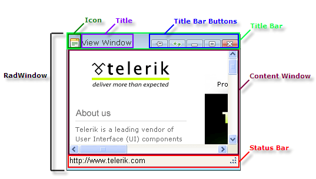

# Element Structure

## 

**RadWindow** controls contain a title bar, which displays the icon, title, and title bar buttons, a content window, and a status bar. These are all configurable using the properties of **RadWindow**.

>caption 

* **Title Bar**: Use the **VisibleTitlebar** property to control whether the window has a title bar.

* **Icon**: Use the **IconUrl** property to specify the image that appears at the far left of the Title Bar.

* **Title**: By default, the Title shows the title of the HTML in the Content Window or theURL that provides that content. You can override this behavior by setting the **Title** property.

* **Title Bar Buttons**: Use the **Behaviors** property to determine which of the buttons that let the user pin, reload, minimize, maximize, restore, and close the window appear on the Title Bar.

* **Content Window**: Use the **NavigateUrl** property to control what content appears in the Content Window.

* **Status Bar**: Use the **VisibleStatusbar** property to control whether the window has a Status Bar to display information about the status or contents of the Content Window.
