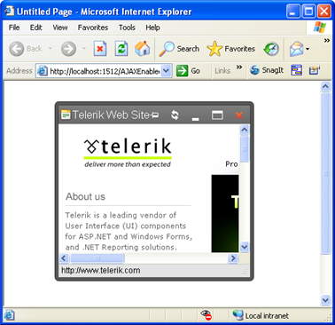

# Getting Started Overview

**RadWindow** is a part of the Telerik® UI for ASP.NET AJAX suite. It is a container that can display content from the same page	(when used as [controls container]()) or it can	[display a content page](), different from the parent one.	In the second case, the control uses an IFRAME and behaves like one.

This getting started article will walk you through creating a web page that shows how to:

* Start a **RadWindow** when the web page first loads.
* Use a **RadWindowManager** to manage multiple windows.
* Launch a **RadWindow** when the user clicks on a control.
* Use skins to alter the appearance of a window.
* Create modal and non-modal windows.
* Specify the behavior and position of a window.

For more information on how to work with and control **RadWindow**, please check the [Client-Side]()/[Server-Side]() Programming sections in this documentation.

## Creating a Window on Startup

1. To create a RadWindow, drag a **RadWindow** control from the Visual Studio Toolbox onto an existing form.

1. In the Behavior section of the Properties menu, set the **Title** property to "Telerik Web Site".

1. Set the **VisibleOnPageLoad** property to **True**.

	>warning This property is used to make the example simpler. The [Opening from the server]() help article explains how to open a RadWindow with server code in more detail, as well as the implications of the **VisibleOnPageLoad** property and when it should **not** be used.

1. In the Navigation section, set the **NavigateUrl** property to **https://www.telerik.com**

	

1. Press F5 to run the application.

You should see the window pop up immediately. Experiment with the window by moving it on the form, using the "pin" button, maximizing and restoring it, and finally closing the window.

## Using RadWindowManager with Multiple Windows

Although you can use **RadWindow** controls directly, if you are working with multiple **RadWindow** controls it is a good idea to use a **RadWindowManager** control. It allows you to create **RadWindow instances dynamically - with JavaScript** alone, without as much as a postback. Also, it can be used at a **central place to set the common properties for all dialogs it opens**, thus minimizing the configuration steps you need to perform.

You'll now modify the previous example to delete the **RadWindow** you just created and use a	**RadWindowsManager** control to host two **RadWindow** controls.

1. Delete the **RadWindow** control from your form. You will now use a **RadWindowManager** to create the **RadWindow** controls instead.

1. Drag a **RadWindowManager** from the Toolbox onto your form.

1. Expand the **Misc** section of the Properties window, find the **Windows** property and click on the	**ellipsis** button to display the [RadWindow Collection Editor]().

1. In the RadWindow Collection Editor, click the **Add** button to create a new **RadWindow** control.Use the Properties pane to set its properties to match those of the window you created before:
	* Set the **Title** property to "Telerik Web Site".
	* Set the **NavigateUrl** property to **https://www.telerik.com**
	* Do **not** set the **VisibleOnPageLoad** property this time.
		

1. Click the **Add** button again to create another **RadWindow** control. Use the Properties pane to set the following properties:
	* Set the **ID** property to "rwDialog".
	* Set the **Modal** property to **True**.

1. Click **Ok** to exit the RadWindow Collection Editor for now.

## Creating a Form for the Dialog

Before continuing with the multiple window example, you need to create a dialog form for the second **RadWindow**.

1. In the Solution Explorer, right-click on the project and choose **Add New Item** to display the Add New Item dialog box	.

1. Add a new Web Form, giving it the name **"MyDialog.aspx"**.

1. In the body of the Web Form, enter the literal text **"My dialog content here..."**.

1. Move to the **Source** view and change the title for this form to **"My Dialog"**. The markup should look similar to this:

	**ASP.NET**	     
	
		<head runat="server">
		  <title>My Dialog</title>
		</head>
		<body>
		  <form id="form1" runat="server">
		  

			My dialog content here...

		  </form>
		</body>

## Launching Windows from Another Control

1. Return to your default form and add a **Button** control from the Standard section of the toolbox. Set its properties as follows:
	* Set the **ID** property to **"btnTelerik"**.
	* Set the **Text** property to **"Show Telerik site"**.

1. Copy the **Button** control to create a second **Button**. Set its **ID** property to **"btnDialog"** and its **Text** property to **"Show My Dialog"**.

1. Select the **RadWindowManager**, and use the **Windows** property to bring up the RadWindow Collection editor again.
	* Select the first **RadWindow** in the collection and set its **OpenerElementId** property to **"btnTelerik"**.
		>note The **OpenerElementId** property requires the **ClientID** of the HTML element	that will open the **RadWindow** when clicked.
	* Select the second **RadWindow** in the collection (rwDialog), and set its **OpenerElementID** property to **"btnDialog"**. Set its **NavigateUrl** property to **"MyDialog.aspx"**.
		>tip There are other ways to open a dialog and they are explained in the [Opening Windows]() help article.
	* Click **Ok** to exit the dialog.

1. Right-click the **RadWindowManager** control and select **"Show Smart Tag"**. Use the Smart Tag to set the **Skin** to **"Vista"**.

1. Press **F5** to run the application. Click both buttons to bring up both windows. They both get the "Vista" look from the **RadWindowManager** skin. Note the differences in behavior. The "Telerik Web Site" window gets its title from the **RadWindow** control, while "My Dialog" gets its title from the HTML markup of MyDialog.aspx. The "Telerik Web Site" window is not modal, while "My Dialog" is modal.

1. Exit the application.

## Altering the appearance and behavior of individual windows

1. Select the **RadWindowManager**, and use the **Windows** property to bring up the RadWindow Collection editor again.

1. Select the first **RadWindow** control in the list (the "Show Telerik site" window).
	* Set its **Skin** property to "Default 2006".
	* Set its **Top** property to 30 and its **Left** property to 0.
	* Set its **OffsetElementId** property to "btnTelerik".
	* Set its **VisibleStatusBar** property to **False**.

1. Select the second **RadWindow** control in the list (the "Show My Dialog" window).
	* Set its **Behaviors** property to "Close, Move".
	* Set both its **Height** and **Width** properties to 200.

1. Click Ok to exit the Collection editor.

1. Run the application.
	* Click the "Show Telerik site" label. The window appears 30 pixels below the label you clicked. (If you had not set an OffsetElementId, its position would be relative to the upper left corner of the web page instead of to the label.) Note that the window title bar has changed its appearance to reflect the new skin and that there is no status bar.
	* Click the "Show My Dialog" label. Note that this window still reflects the skin you set in the **RadWindowManager**. The title bar has lost all controls except the close button. Note that you can move the window, but not resize it from the 200 by 200 size you set in the designer.

## See Also

 * [Using RadWindow as Controls Container]()

 * [Opening Windows]()
