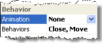

# User Interaction With The Window


## 

Use the __Behaviors__ property to determine how the user can interact with the __RadWindow__ object. __Behaviors__ controls whether the user can move or resize the window, whether it has maximize and minimize buttons, whether it can be pinned, and whether there is a close button on the title bar.

Here are the __Behaviors__' property values:

* __None__ - The user can perform none of the actions on the window.

* __Resize__ - The user can resize the window by dragging its border.

* __Minimize__ - The window can be minimized, and has a minimize button on the title bar.

* __Close__ - The user can close the window using a title bar button.

* __Pin__ - The window can be pinned, and has a pin button on the title bar.

* __Maximize__ - The window can be maximized, and has a maximize button on the title bar.

* __Move__ - The user can click on the window title bar and drag it to a new location.

* __Reload__ - The user can reload the window contents using a title bar button.

* __Default__ - Default object behavior: all of the above.

To specify a combination of behaviors (other than the default), combine __Behaviors__ values. For example, if you want to let the user close the window using a button on the title bar, and to move the window by dragging it, but do not want any other buttons on the title bar, set __Behaviors="Close, Move"__:
>caption 



You can also set the __Behaviors__ property from the codebehind:

>tabbedCode

````C#
	     
							RadWindow1.Behaviors = Telerik.Web.UI.WindowBehaviors.Move | Telerik.Web.UI.WindowBehaviors.Close;
				
````
````VB.NET
	     
							RadWindow1.Behaviors = Telerik.Web.UI.WindowBehaviors.Move Or _ Telerik.Web.UI.WindowBehaviors.Close
				
````
>end


# See Also

 * [Initial Window State]()
