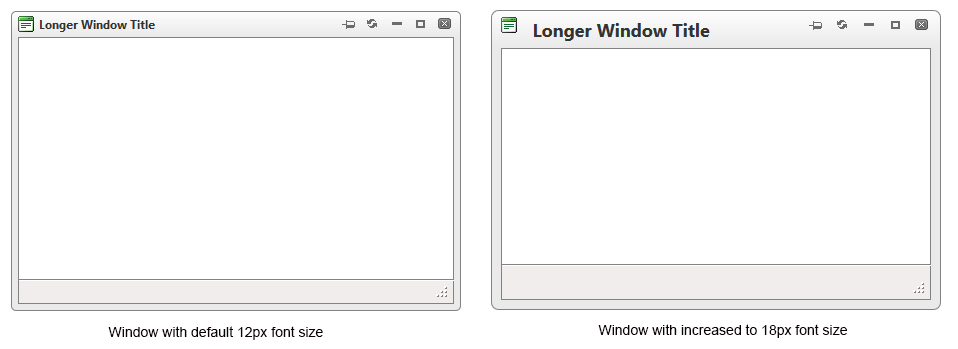

# Responsive, Adaptive and Elastic Capabilities

This article explains the **responsive design capabilities RadWindow offers**.	The [Lightweight RenderMode]() of RadWindow supports	**elastic design since Q2 2014**. It can be said to support fluid/adaptive design since its creation.

@[template](/_templates/common/render-mode.md#resp-design-desc "slug-el: no, slug-fl: no")

This article contains the following sections:
* [Elastic Design with RadWindow](#elastic-design-with-radwindow)
* [Fluid or Adaptive Design with RadWindow](#fluid-or-adaptive-design-with-radwindow)


## Elastic Design with RadWindow

>caption Figure 1: Comparison between appearance of a RadWindow with regular font size and with increased font size



**RadWindow** does not create elastic design by itself, but can fit in a page that follows this pattern. This means that RadWindow does not support dimensions set in percent,but its **Lightweight RenderMode** supports **changing the font size** without breaking the control's appearance - if the new size is larger than the original,the elements in the control will simply increase their size as well to accommodate the text.This fluid layout is achieved by using `em` units for setting dimensions and paddings in the control, instead of `px`because `em` units are tied to the font size. This allows dimensions and sizes to scale with the font size.

Elements that use images or images sprites, however, cannot be increased in size, so the commands will keep having their original dimensions and position(aligned to the top of the titlebar).

@[template](/_templates/common/font-size-notes.md#note-and-example "control: RadWindow")

>caption Example 2: The following sample shows how to increase the font size of a RadWindow and the effect can be seen in comparison in Figure 1.

````ASP.NET
<style type="text/css">
	div.RadWindow
	{
		font-size: 18px;
	}
</style>
<telerik:RadWindow ID="RadWindow1" runat="server" Title="Longer Window Title" VisibleOnPageLoad="true" RenderMode="Lightweight" Width="450">
</telerik:RadWindow>
````

## Fluid or Adaptive Design with RadWindow

For a dialog to adapt to a mobile device and to be fluid, means that it should provide comfortable user interface, take up the entire viewport and resize with the browser screen (for example, when it is rotated).

RadWindow's Elastic design (see above) lets you increase the size of its touch areas, and a maximized RadWindow has a hook on the `window.resize` event so it can maintain its size according to the browser viewport. 

So, to have a fluid/adaptive RadWindow, you need to take the following steps:

1. Determine the condition that will invoke such behavior. For example, a certain screen size and/or the device being a [touch device]().
2. Add a handler to the [OnClientShow]() event.
3. Use the control's [client-side API]() to configure it accordingly (such as to maximize it and to leave only the Close button).

>caption Example 3: How to make an adaptive RadWindow that takes 100% of the screen on mobile devices

````ASP.NET
<telerik:RadWindowManager runat="server" ID="RadWindowManager1" RenderMode="Lightweight" OnClientShow="OnClientShow">
</telerik:RadWindowManager>
<script>
	function shouldMakeAdaptiveRadWindow() {
		//true for touch devices that are narrower than 768px which is a common tablet size
		return Telerik.Web.BrowserFeatures.touchEvents && $telerik.$(window).width() < 768;
	}

	function OnClientShow(sender, args) {
		if (shouldMakeAdaptiveRadWindow()) {
			//leave only the close button
			sender.set_behaviors(Telerik.Web.UI.WindowBehaviors.Close);
			sender.set_visibleStatusbar(false);
			//maximize so it takes up the entire viewport and reacts to size changes
			sender.maximize();
		}
	}
</script>
<asp:Button Text="open a RadWindow" ID="btn1" OnClientClick="radopen(); return false;" runat="server" />
````

>tip The [extended example](extensive-fluid-example.zip) archive provides extensive comments so you can customize the RadWindow behavior, and shows a few additional tricks:
>
> * using a CSS class to enlarge the titlebar button only
> * attaching the OnClientShow handler to all RadWindow instances without code changes to their definitions
> * handling the [predefined dialogs]() differently
> * implementing a screen size check through the [Telerik DeviceDetectionFramework]().

>tip You can use a mobile-friendly Skin that has large touch areas such as `MetroTouch`, `Material`, `Bootstrap`. You can also use the [fluid design capabilities of the control](#elastic-design-with-radwindow) to increase its font-size and thus, the touch areas size.

>tip If you want the RadWindow to take up a different percentage of the screen, see the [Setting size in percent for the RadWindow](https://www.telerik.com/support/kb/aspnet-ajax/window/details/setting-size-in-percent-for-the-radwindow) article.

## See Also

 * [Render Modes]()

@[template](/_templates/common/font-size-notes.md#related-resources)