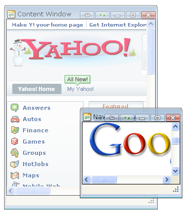

# Window Overview

Telerik RadWindow lets you build customized dialog boxes and modal or non-modal windows for a web application. Each RadWindow object generates a popup window that appears in the browser. 

#### Advantages over the browser windows:

* **The appearance of Telerik RadWindow can be easily customized** using [skins](). This allows you to easily blend it with the design of your web application. RadWindowfeatures new transparency and animation effects. In addition in the new version you can have different skins for different RadWindows on the same page.

* **RadWindow offers full control over window visibility and location** using simple design-time properties to control [showing]() and positioning of windows.

* **RadWindow supports a rich client event model**. You can use the [client-side events]() to provide a level of interaction with the user typically possible only in windows applications.

* **Built-in dialogs for alert, confirm, and prompt boxes can replace the browser dialogs** to blend into the look and feel of your Web site. The predefined [alert, confirm, and prompt dialogs]() offer you more control over the look and behavior of these dialogs.

* **RadWindow objects are cached** so that once a window is loaded it is not destroyed when you hide it. The next time your application shows the window, there is no loading time. You can still execute initialization code and pre-set the elements in the window by adding an **OnClientShow** [event handler]().

* **RadWindow supports a cross-browser look and feel on modal dialogs.** Creating cross-browser modal dialogs has always been a challenging task for developers, but RadWindow has built-in cross-browser support so you can do this simply by just setting the **Modal** property on your windows.

* **RadWindow supports passing arguments** to your windows and lets you easily return those arguments. You can [use the argument attribute](), or [pass parameters as part of a URL]().

* **RadWindow objects can be minimized into minimize zones**. By using [minimize zones]() you can create a taskbar effect in your applications.

* **RadWindow objects are not suppressed by the Windows XP SP2 popup blocker mechanism**. By using RadWindow, your application interface works without users having to adjust the security settings of their browsers.

## See Also

 * [Differences from RadDock]()
