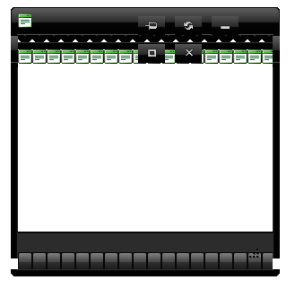

# Distorted Appearance

Sometimes the appearance of a RadWindow popup seems distorted with what is commonly described as "lines", "boxes" or "space".	The issue is most often seen in the titlebar and statusbar, for example:



## Cause for the problem

Such behavior is not isolated to RadWindow, but can manifest with many other controls from the Telerik® UI for ASP.NET AJAX suite.Its origin is usually some **global CSS rule on the page**. It changes the dimensions of the elements the control uses and expects, so the image sprites that create the backgrounds / borders in many controls start to "leak" or show more from the image than should be shown.

UI controls rely on a complex HTML markup structure to create the layout expected from them and this is done with a set of CSS rules.This means that changing the default values the controls expect can cause problems with them. The screenshot above was created with the following markup:

````ASP.NET
<style type="text/css">
	td { padding: 10px; }
	li { margin: 5px; }
</style>
<telerik:RadWindow RenderMode="Lightweight" ID="RadWindow1" runat="server" VisibleOnPageLoad="true" Skin="Black">
</telerik:RadWindow>
````

Selectors that can cause similar problems can include elements like *table, tr, td, ul, li, etc.*

## How to resolve it

Such global rules should, generally, be avoided, as they can break the appearance of third-party controls and cause other unexpected behaviour on the given site. The following list of steps can help to quickly find and resolve such problems:

1. **Remove all custom CSS** from the page to verify if this is the cause for the problem. This can be done with commenting or deleting the references to stylesheets and inline styles like in the example above.

1. **Clear the browser and ASP caches** to make sure the content is fresh. Reload the page in the browser completely (usuallyCtrl+F5).

1. **If the issue is gone** start **re-adding the custom CSS piece by piece** to find the offending rule and make it more specific (e.g. add a class).
