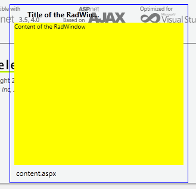

# Missing Borders, TitleBar, Commands

Sometimes the borders, TitleBar and StatusBar of the RadWindow do not show up when it is opened, effectively making it impossible to close because the command buttons are part of the TitleBar.

>caption An example showing how the background can be seen through the RadWindow's UI. The blue border indicates where its actual end should be.

This behavior is most common under **Internet Explorer** and is usually due to its [31 stylesheets limitation](https://blogs.telerik.com/aspnetmvcteam/posts/10-05-03/internet-explorer-css-limits.aspx). It loads stylesheets alphabetically and the RadWindow is often late in the list. Another factor that contributes to this is that it loads the sprites that actually form the backgrounds of the titlebar and borders only when they are needed (i.e. when it is shown for the first time).

A rather easy solution for this is to add a [RadStyleSheetManager]() to the page so that requests for the stylesheets will be combined thus the total number of requests will be reduced.

Whether this is the reason is easily determined by opening the same page in a different browser, for example Firefox. if it looks as it should then the origin is IE's limitation.

When this is observed in other browsers as well the reason can be that the **EnableEmbeddedSkins** property of the RadWindow/RadWindowManager is set to **false**. This does not allow it to load its skin-specific file which holds the links to the image sprites and should only be used when a [custom skin]() has been created and correctly applied.

Another possible reason is that the WebResource requests are not received by the browser. If this is the case is easily determined by monitoring the network activity in the developer bar of choice - FireBug, the IE Dev toolbar (since IE9), Chrome's Network resources, or by using Fiddler. If the requests return a server error (status code 500) the [WebResource Troubleshooting article]() can be helpful. If, for example, 404 is returned (or some other network-related status) the most likely reason is a firewall, proxy or some other network issue that is blocking the requests and the solution should be sought in the networks structure or by using the [RadStyleSheetManager's CDN]() to load the resources from a different server as physical files.

## See Also

 * [IE's 31 stylesheets limitation](https://blogs.telerik.com/aspnetmvcteam/posts/10-05-03/internet-explorer-css-limits.aspx)
 
 * [RadStyleSheetManager Overview]()
