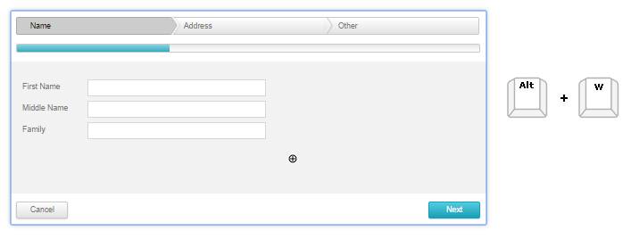
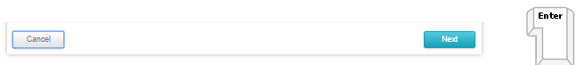

# Keyboard Support

## 

__RadWizard__ provides support for the two relevant aspects of keyboard support:

* __Access Keys__ - You can specify a key that lets the end-user move focus directly to the __RadWizard__. The access key is defined using the __AccessKey__ property. For example, if you set the __AccessKey__ property to "W", focus moves to the __RadWizard__ when the user types "Alt+W".

* __Key Navigation__-when focus is on the __RadWizard__, the user can use the "Tab" key to navigate through the controls and wizard step buttons. Once a wizard step button is focused use the arrow keys or TAB to navigate through the items and press Enter to trigger the button's event.

* The "Alt + W" focuses the wizard control. 

* The "Tab" key navigates through the controls and wizard step buttons. 

* Once a wizard step button is focused use the arrow keys or TAB to navigate through the items and press Enter to trigger the button's event.

>note In order to enable the keyboard support in browsers, different from Internet Explorer, you shoud set the __TabIndex__ property of the __RadWizard__ .
>

