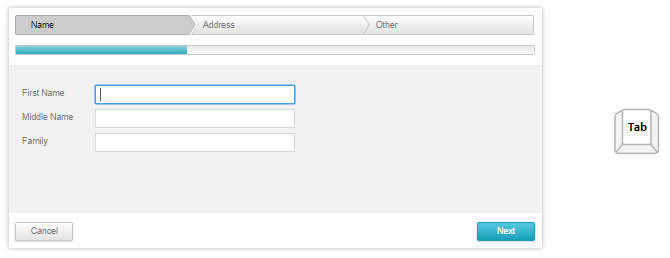

# Keyboard Support

## 

**RadWizard** provides support for the two relevant aspects of keyboard support:

* **Access Keys** - You can specify a key that lets the end-user move focus directly to the **RadWizard**. The access key is defined using the **AccessKey** property. For example, if you set the **AccessKey** property to "W", focus moves to the **RadWizard** when the user types "Alt+W".

* **Key Navigation**-when focus is on the **RadWizard**, the user can use the "Tab" key to navigate through the controls and wizard step buttons. Once a wizard step button is focused use the arrow keys or TAB to navigate through the items and press Enter to trigger the button's event.

* The "Alt + W" focuses the wizard control. 

* The "Tab" key navigates through the controls and wizard step buttons. 

* Once a wizard step button is focused use the arrow keys or TAB to navigate through the items and press Enter to trigger the button's event.

>note In order to enable the keyboard support in browsers, different from Internet Explorer, you shoud set the **TabIndex** property of the **RadWizard** .
>

