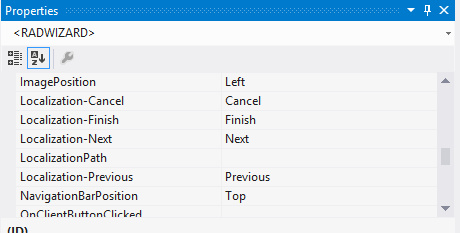
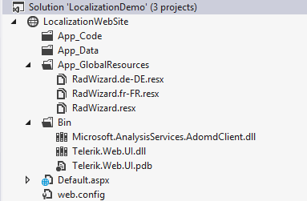
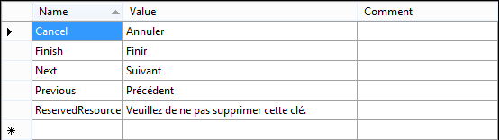
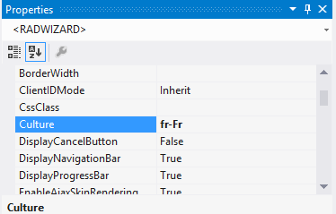

# Localization


The localization support for __RadWizard__ lets you translate some of the control’s predefined strings.

## Localization property

By changing the values of each of its named properties, you change the appearance of the respective strings:

````ASPNET
	            <telerik:radwizard id="RadWizard8" runat="server" width="500px" Localization-Next="Next" Localization-Finish="Finish" >
	                <WizardSteps>
	                    <telerik:RadWizardStep Title="First Step">
	                        <telerik:RadTextBox ID="RadTextBox17" Label="First Name:" runat="server"></telerik:RadTextBox>
	                        <br />
	                        <telerik:RadTextBox ID="RadTextBox18" Label="Last Name:" runat="server"></telerik:RadTextBox>
	                    </telerik:RadWizardStep>
	                    <telerik:RadWizardStep Title="Second Step">
	                    </telerik:RadWizardStep>
	                    <telerik:RadWizardStep Title="Finish Step" StepType="Finish">
	                    </telerik:RadWizardStep>
	                    </WizardSteps>
	                    </telerik:radwizard>
	            
````




>note This technique is useful when customizing some of the strings of a __particular instance__ . The messages are not shared between RadWizard instances. A complete translation using this approach is inappropriate.
>


## Global Resource files

The primary means for localization in ASP.NET is to use __resource files__. Resource files are simple XML files that can be easily edited and transferred to other applications. You can use resource files to change the default (English) localization for RadWizard that is stored in the Telerik.Web.UI assembly.

Follow these steps to create a global resource file to localize the RadWizard:

1. Create the __App_GlobalResources__ folder in the root of your Web Application.

2. Copy the default resource __RadWizard.resx__ file into it. This file can be found in the __App_GlobalResources__ folder of the directory where you installed RadControls for ASP.NET AJAX.

3. Make a copy of the file and rename the copy so that its name contains the __Culture Identifier__. The resource files used by RadComboBox follow a strict naming convention: RadWizard.<Culture Identifier>.resx

>note The Culture Identifier consists of a language code followed by a dash and the country code. Example: “en-US”, “fr-CA” and so on.
>


For example, add the __RadWizard.fr-FR.resx__ file to the App_GlobalResources folder (both localization files should be present there):




4. Edit the strings using the Visual Studio editor or your favorite text editor. Customize strings just as you would set the Localization property.



>caution Make sure that the __ReservedResource__ entry is preserved. It is used for identification purposes and is never displayed.
>


You can now switch the resource file RadComboBox uses with the new one:


