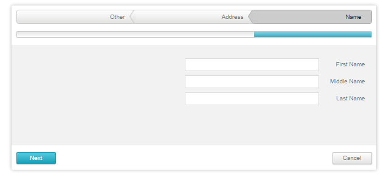

# RTL Support


The Telerik **RadWizard** supports right-to-left (RTL) direction.

To put the **RadWizard** control in RTL mode, its parent container should have its **CSS direction** property or **dir attribute** set to **rtl**.

This parent element can be the **BODY**, the **HTML** element, or just a simple wrapper element. If you set the direction of the body tag (or any other parent element that contains the control) to rtl,**RadWizard** reverses the step order and aligns itself to the right side of the container. The rendered result from the code in **Example 1** is illustrated in **Figure 1**.

## 
>caption Figure 1: RadWizard control in Right-to-Left mode



**Example 1**: Putting the **Telerik RadWizard** in Right-to-Left mode

````ASPNET
<telerik:RadWizard RenderMode="Lightweight" runat="server" ID="RadWizard9" Width="800px" Height="360px" DisplayCancelButton="true" dir="rtl">
	<WizardSteps>
		<telerik:RadWizardStep ID="RadWizardStep2" Title="Name" StepType="Start">
			<telerik:RadTextBox RenderMode="Lightweight" runat="server" ID="RadTextBox19" Label="First Name" LabelWidth="105px" Width="400px">
			</telerik:RadTextBox>
			<br />
			<telerik:RadTextBox RenderMode="Lightweight" runat="server" ID="RadTextBox20" Label="Middle Name" LabelWidth="105px" Width="400px"></telerik:RadTextBox>
			<br />
			<telerik:RadTextBox RenderMode="Lightweight" runat="server" ID="RadTextBox21" Label="Last Name" LabelWidth="105px" Width="400px"></telerik:RadTextBox>
		</telerik:RadWizardStep>
		<telerik:RadWizardStep ID="RadWizardStep3" Title="Address" DisplayCancelButton="false">
			<telerik:RadTextBox RenderMode="Lightweight" runat="server" ID="RadTextBox22" Label="Country" LabelWidth="105px" Width="400px"></telerik:RadTextBox>
			<br />
			<telerik:RadTextBox RenderMode="Lightweight" runat="server" ID="RadTextBox23" Label="City" LabelWidth="105px" Width="400px"></telerik:RadTextBox>
			<br />
			<telerik:RadTextBox RenderMode="Lightweight" runat="server" ID="RadTextBox24" Label="Address" LabelWidth="105px" Width="400px"></telerik:RadTextBox>
		</telerik:RadWizardStep>
		<telerik:RadWizardStep ID="RadWizardStep4" Title="Other" StepType="Finish">
			<telerik:RadTextBox RenderMode="Lightweight" runat="server" ID="RadTextBox25" Label="Hobby" LabelWidth="105px" Width="400px"></telerik:RadTextBox>
			<br />
			<telerik:RadTextBox RenderMode="Lightweight" runat="server" ID="RadTextBox26" Label="Music" LabelWidth="105px" Width="400px"></telerik:RadTextBox>
			<br />
			<telerik:RadTextBox RenderMode="Lightweight" runat="server" ID="RadTextBox27" Label="Sport" LabelWidth="105px" Width="400px"></telerik:RadTextBox>
		</telerik:RadWizardStep>
		<telerik:RadWizardStep ID="RadWizardStep5" StepType="Complete">
			<asp:Label ID="Label5" runat="server" Text="Values filled" Font-Bold="true" />
			<br />
			<asp:Label ID="Label6" runat="server" />
		</telerik:RadWizardStep>
	</WizardSteps>
</telerik:RadWizard>
````


# See Also

 * [See this live in an online demo](http://demos.telerik.com/aspnet-ajax-beta/wizard/accessibility-and-internationalization/right-to-left/defaultcs.aspx)
