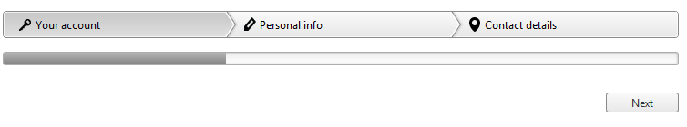

# Adding Images to Steps


## 

Each __RadWizardStep__ has a set of properties you can use to add images to your steps.You can simply add a single image to each step, or you can add separate images that reflect the state of the step.

The image appears to the left of the step title (unless you are using a [right-to-left orientation](), in which case it appear to the right of the step title).

The following properties let you add images to steps:

* __ImageUrl__ specifies an image that is added to the step.

* __HoveredImageUrl__ specifies an image that is used when the mouse is over the step element.

* __ActiveImageUrl__ specifies an image that is used when this step is active.

* __DisabledImageUrl__ specifies an image that is used when the step is disabled.

The following example uses the __ImageUrl__ property to apply images to the steps:

````ASPNET
	        <telerik:RadWizard runat="server">
				<WizardSteps>
					<telerik:RadWizardStep ImageUrl="Images/YourAccount.png" Title="Your account">
						
					</telerik:RadWizardStep>
					<telerik:RadWizardStep ImageUrl="Images/PersonalInfo.png" Title="Personal info">
						
					</telerik:RadWizardStep>
					<telerik:RadWizardStep ImageUrl="Images/ContactDetails.png" Title="Contact details">
						
					</telerik:RadWizardStep>
				</WizardSteps>
			</telerik:RadWizard>
````




RadWizard provides support for sprites.This functionality is controlled by the __RadWizardStep__ property __SpriteCssClass__. Its purpose is to replace the step image element with a sized span for easier use of sprites. Unlike the use of ImageUrl property which will make a request for each image this approach will get and use one image that combines all step icons.

The following example uses the __SpriteCssClass__ property to apply images to the steps:

````ASPNET
	        <style type="text/css">
	            .rwzImage {
	                background-image: url("Images/breadcrumb-sprite.png");
	            }
	
	            .YourAccount {
	                background-position: 0 0;
	            }
	
	            .PersonalInfo {
	                background-position: 0 -20px;
	            }
	
	            .ContactDetails {
	                background-position: 0 -40px;
	            }
	        </style>
	
	        <telerik:radwizard runat="server">
				<WizardSteps>
					<telerik:RadWizardStep SpriteCssClass="YourAccount" Title="Your account">
						
					</telerik:RadWizardStep>
					<telerik:RadWizardStep SpriteCssClass="PersonalInfo" Title="Personal info">
						
					</telerik:RadWizardStep>
					<telerik:RadWizardStep SpriteCssClass="ContactDetails" Title="Contact details">
						
					</telerik:RadWizardStep>
				</WizardSteps>
			</telerik:radwizard>
	    </form>
	
	    <script>
	        var $ = $telerik.$;
	
	        function pageLoad() {
	            var imagesClass = "rwzImage";
	
	            $(".rwzLink").each(function () {
	                $($(this).children()[0]).addClass(imagesClass);
	            })
	        }
	    </script>
````


By default this approach sets width and height for the span element to 16px. In some cases you might need to change it and use icons with different size. An easy way to achieve this is just to add the following styles.

````ASPNET
	    <style type="text/css">
	        html .RadWizard .rwzBreadCrumb span.rwzImage {
	            width: 24px;
	            height: 24px;
	        }
	    </style>
````


