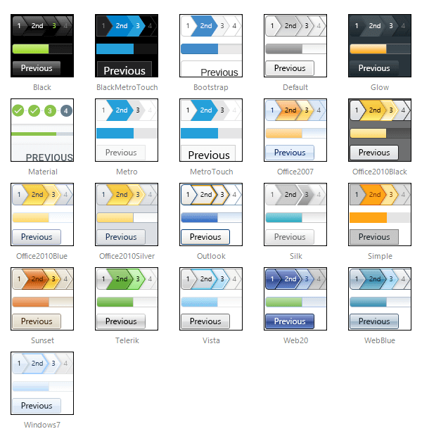

# Skins

## 

**RadWizard** uses **skins** to control its overall look-and-feel. A skin is a set of images and a CSS stylesheet that can be applied to the control elements (items, images, etc.) and defines their appearance.

To apply a skin to a **RadWizard** control, set its **Skin** property.

**RadWizard** is installed with a number of preset skins. These are shown below:
>caption 

 

 @[template - Material skin is available only in Lightweight mode](/_templates/common/skins-notes.md#material-only-in-lightweight) 

