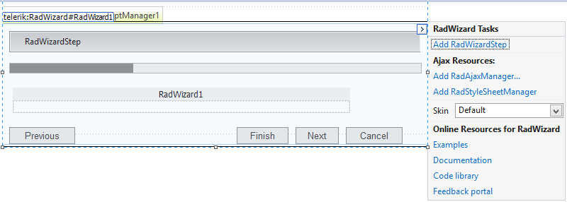

# Design Time

## 

The __RadWizard__ control offers a Smart Tag that lets you perform several basic actions:
>caption Figure 1: RadWizard Smart Tag

* Add the main manager controls from the suite:

* The __Add RadWizardStep...__ link adds a RadWizardStep component to the RadWizard control.

* The __Add RadAjaxManager...__ link adds a RadAjaxManager component to your Web page, so you can configure partial postbacks through a comfortable control.

* The __Add AddRadStyleSheetManager__ link adds a RadStyleSheetManager to your Web page.

* Choose the skin - The __Skin__ dropdown lists all available skins for the control so you can select one that matches the look and feel of the rest of the page. The skins are displayed via small images to give you a better idea of the color scheme they use.

* Explore learning resources - the last section of the Smart Tag provides several links navigate you directly to the given tile type's online documentation and code library.
