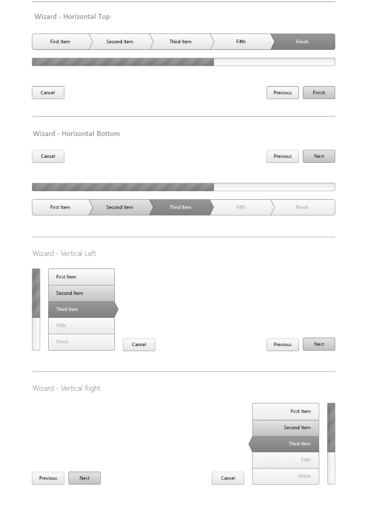

# Orientation

This help article how you can achieve horizontal or vertical orientation of **RadWizard**.

## 

The Navigation and Progress bar can be either horizontal or vertical oriented. The following **NavigationBarPosition** and **ProgressBarPosition** properties control the position of these components.

Combining those two properties values can achieve different orientation:

* **Horizontal** - the position of Navigation and Progress bar are set either to **Top** or **Bottom**. It is absolutely valid scenario if the Navigation bar is top positioned and the Progress bar is bottom positioned.

* **Vertical** - the position of Navigation and Progress bar are set either to **Left** or **Right**. It is absolutely valid scenario if the Navigation bar is left positioned and the Progress bar is right positioned.

>caution NavigationBar and ProgressBar can be only placed either on the same side or on opposite sides of the RadWizard control.
>

>caption Figure 1: RadWizard Orientation options

# See Also

 * [Wizard - Orientation demo](https://demos.telerik.com/aspnet-ajax/wizard/functionality/orientation/defaultcs.aspx)

