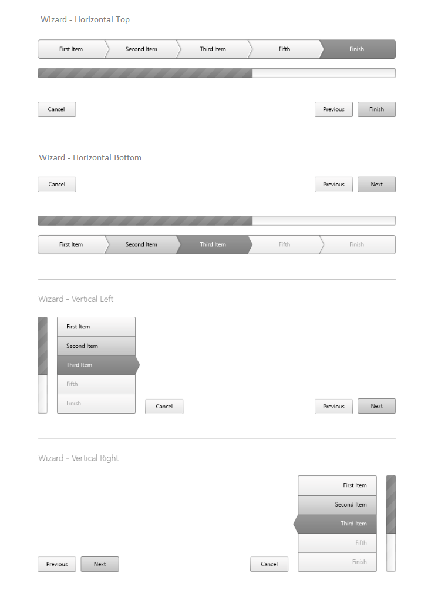

# Orientation

This help article how you can achieve horizontal or vertical orientation of __RadWizard__.

## 

The Navigation and Progress bar can be either horizontal or vertical oriented. The following __NavigationBarPosition__ and __ProgressBarPosition__ properties control the position of these components.

Combining those two properties values can achieve different orientation:

* __Horizontal__ - the position of Navigation and Progress bar are set either to __Top__ or __Bottom__. It is absolutely valid scenario if the Navigation bar is top positioned and the Progress bar is bottom positioned.

* __Vertical__ - the position of Navigation and Progress bar are set either to __Left__ or __Right__. It is absolutely valid scenario if the Navigation bar is left positioned and the Progress bar is right positioned.

>caution NavigationBar and ProgressBar can be only placed either on the same side or on opposite sides of the RadWizard control.
>

>caption Figure 1: RadWizard Orientation options

