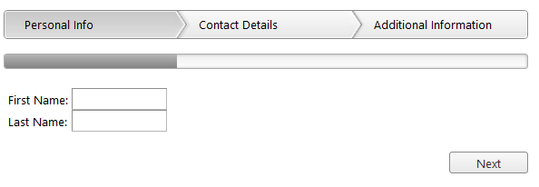

# Getting Started


The following tutorial demonstrates how you can add a __RadWizard__ control with three steps. The end result will be similar to __Figure 1__:
>caption Figure 1: RadWizard with three steps.



## 

1. Add a __ScriptManager__ control on a Web Form.

1. Add a __RadWizard__ control on this AJAX-enabled Web Form:__Example 1__: Declaration of a __RadWizard__ control:

````ASPNET
	             <telerik:RadWizard ID="RadWizard2" runat="server" Width="550px">
	                <WizardSteps>
	                    <telerik:RadWizardStep Title="Personal Infor">
	                        <telerik:RadTextBox ID="FirstNameTextBox" Label="First Name:" runat="server"></telerik:RadTextBox>
	                        <br />
	                        <telerik:RadTextBox ID="LastNameTextBox" Label="Last Name:" runat="server"></telerik:RadTextBox>                  
	                    </telerik:RadWizardStep>
	                    <telerik:RadWizardStep Title="Contact Details">
	                    </telerik:RadWizardStep>
	                    <telerik:RadWizardStep Title="Additional Information">
	                    </telerik:RadWizardStep>
	                </WizardSteps>
	            </telerik:RadWizard>
````


