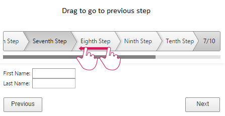

# Gestures

## 

**RadWizard** for ASP.NET AJAX handles gestures from touch enabled screens. You can use the drag to perform scrolling between the wizard steps as shown in **Figure 1**.

**Figure 1** illustrates how to use touch device gestures on **RadWizard**.
>caption Figure 1: RadWizard handles drag to scroll between the wizard steps.

