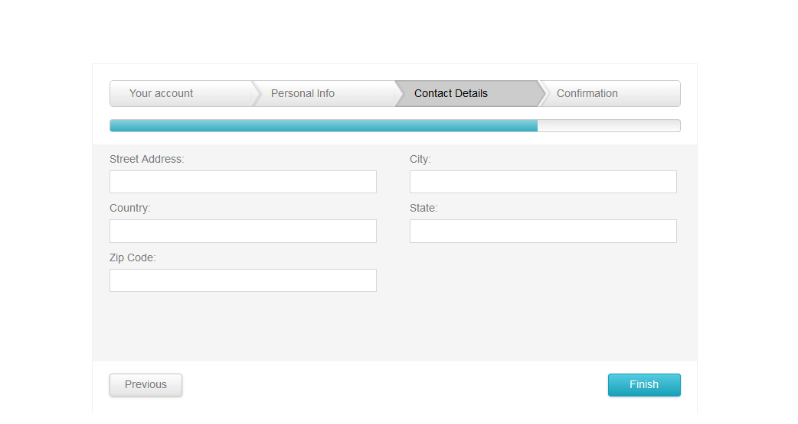

# Wizard Overview

**RadWizard** for ASP.NET AJAX is a Step-by-Step User Interface which takes the user through a series of steps in order to accomplish some task or collect user input.It also shows the current level of completion of the entire process by the built-in progress bar.

## 
>caption Figure 1: Three RadWizard in an ASP.NET page

The **RadWizard** control in the Telerik® UI for ASP.NET AJAX suite is available since the **2014 Q3** version.

The control offers a rich set of features:

* [Built-in progress bar]() for level of completion of the form.

* [ProgressBar and NavigationBar Orientation]().

* [Different types of steps]().

* [Tracking history functionality]().

* [Mobile render mode]().

* [Validation]().

* [Right-to-left support]()

* Rich [client-side]() and [server-side ]() API.

* [Multiple client-side events]().
