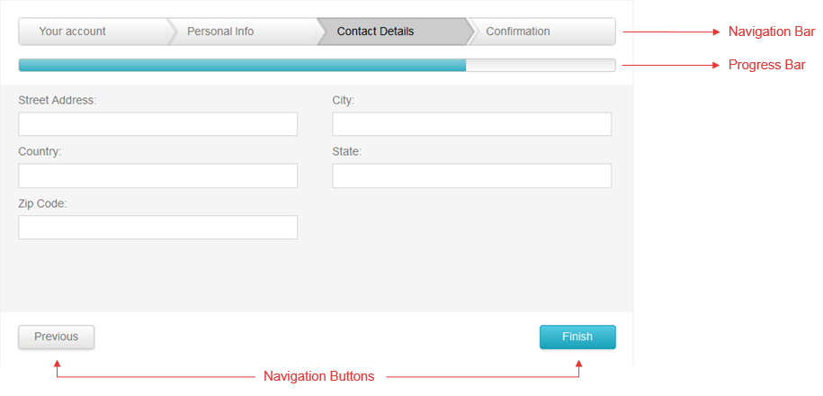

# RadWizard Element 

In this article you can find the names of the **RadWizard** UI elements (**Figure 1**) and learn more about their purpose.

## 
>caption Figure 1: A RadWizard Element Structure

### Progress Bar

The progress bar shows the current level of completion of the wizard steps.

### Navigation bar

This is is an optional wizard element that contains buttons like elements that provides the user with a quick-launch user interface to randomly reach any step of the wizard.

### Navigation buttons

The **RadWizard** navigation buttons are special buttons positioned at the bottom of the control. The following Next, Previous, Finish and Cancel navigation buttons are generated based on the current **RadWizard StepType**. Each of them has a separate server and client event that can be handled and can be localized.
