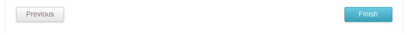
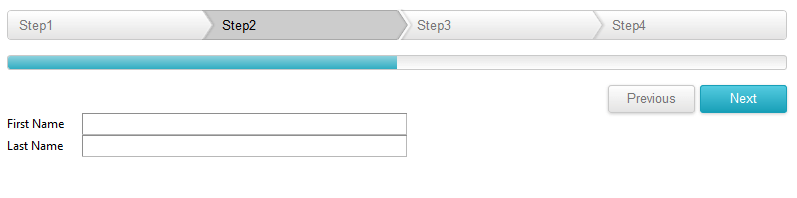

# Steps

**RadWizardStep** represents one of the child views that can be displayed in the RadWizard.

## RadWizard Properties:

Each RadWizardStep has the following properties:

* **Title** - the text printed in RadWizardStep element.

* **ID** - the id value that can be used in order to access this step on the server-side.

* **ToolTip** - shows a text when user hovers on a RadWizardStep.

* **Enabled** - enables/disables the RadWizardStep.

* **AllowReturn** - allows/prevents the step from being activated more than once. The default value is **"True"** and users are able to go back to this step as many times as they want.

* **DisplayCancel** - shows/hides the cancel button for a step.

* **ValidationGroup** - specifies which group of controls is validated on validation.

* **CausesValidation** - enables/disables the validation functionality if user tries to change the current step.

* **ImageUrl** - specifies an image to be displayed as an icon next to the RadWizardStep. The position of this image is controlled by the property **ImagePosition** defined globally for the RadWizard control.

* **ActiveImageUrl, DisabledImageUrl, HoveredImageUrl** - like **ImageUrl** specifies an image to be displayed for the active, disabled and hovered step.

* **SpriteCssClass** - replaces the step image element with a sized span for easier use of sprites. This property value is applied to the rendered span element as a class attribute. In this CSS class rule you can define the the path to the background image.

>note In order to use any of the following properties **ActiveImageUrl, DisabledImageUrl, HoveredImageUrl** it requires setting the **ImageUrl** as well.
>

Along with the already mentioned properties the **RadWizardStep** provides a **StepType** property.Different step types provide specific predefined layout and functionality ready to be used in real world scenarios.

The following types are:

* **Start** - includes just a Next button.

* **Step** - includes both a Next and Previous button.

* **Finish** - includes Previous and Finish buttons

* **Complete** - displays a summary of the task performed after the Finish button has been clicked from the Finish step.

* **Auto** - (the default) the rendered navigation buttons are automatically determined based on the index of the step itself as follows: the first step in the wizard is assumed to be the Start step, the last step the Finish step, and all other steps are considered Step steps; no step is automatically considered a Complete step (if you want a Complete step, it must be explicitly specified).

## Navigation Buttons:
>caption Figure 1: RadWizard Navigation buttons

The **RadWizardStep** navigation buttons are special buttons for navigation between the steps and by default are positioned at the bottom of the **RadWizard** These buttons Next, Previous, Finish and Cancel navigation buttons are generated based on the current **RadWizard StepType**. Each of them can be localized and has a separate server and client event that can be handled.

As of Q3 2014 SP1 you are able to hide and position top the **RadWizardStep** navigation buttons:

* You can set the **RadWizardStep** DisplayNavigationButtons="false" to hide the navigation buttons.

* You can set the **RadWizardStep** NavigationButtonsPosition="Top" to position top the navigation buttons as shown in the screen shot below:
>caption Figure 2: RadWizard Navigation buttons top positioned

