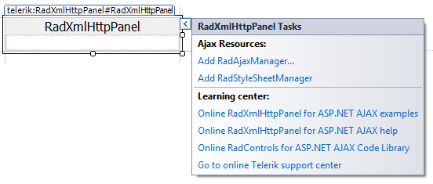

# Design Time

The Smart Tag of **RadXmlHttpPanel** lets you configure your control or quickly get help. You can display the	Smart Tag by right clicking on a **RadXmlHttpPanel** control and choosing "Show Smart Tag", or clicking the small rightward-pointing arrow located in the upper right corner of the control.

## Ajax Resources

* **Add RadAjaxManager...** adds a **RadAjaxManager** component to your Web page, and displays the **r.a.d.ajax Property Builder** where you can configure it.

* **Add RadStyleSheetManager** adds a **RadStyleSheetManager** component to your Web page.

## Skin

The **Skin** drop-down displays a list of available skins that you can apply to your control, along with an example of what the **RadXmlHttpPanel** control looks like for each skin. Assign a skin by selecting the one you want from the list.

## Learning Center

* Links navigate you directly to examples, help, and code library.

* You can navigate directly to the [Telerik Support Center](http://www.telerik.com/support/home.aspx).
