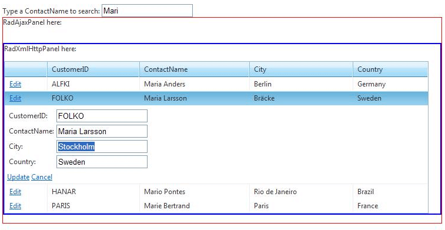

# Differences Between RadXmlHttpPanel and RadAjaxPanel


## RadAjaxPanel vs. RadXmlHttpPanel

1. Telerik __RadAjaxPanel__, compared to the __RadXmlHttpPanel__, is more flexible and can be used in just about any scenario. This flexibility comes at a price – the page goes through its full page lifecycle. The whole control tree is created, all event handlers are executed, the ViewState is processed and updated, and sent back to the client. This makes the __RadAjaxPanel__ very easy to use, and almost any control from the Telerik UI or ASP.NET AJAX controls can be hosted inside. The server-side event handlers (of the controls’ server-side events placed inside the panel) execute correctly and the affected controls are updated accordingly. This makes the __RadAjaxPanel__ suitable to load dynamic page content, which requires server-side interactions and updates among the controls hosted inside the panel.

1. Telerik __RadXmlHttpPanel__ is a panel that can load content on demand, by using ASP.NET's Callback mechanisms and Web Services. Client callbacks and web services offer a performance gain over the AJAX partial updates, but cannot be used in many scenarios like AJAX. They do not offer ViewState and there is no page lifecycle. This prevents the server-side event handlers from execution and therefore the server-side interaction among the controls inside the panel is limited. This being said, the __RadXmlHttpPanel__ is primarily intended to be used for loading presentation data. If any modifications or updates are to be performed on the content they should be done on the client-side.


## Which one should be used?

__RadAjaxPanel__ can cover all scenarios, while __RadXmlHttpPanel__ should be used mostly for presenting data.To put it in simpler terms, controls loaded in the __RadXmlHttpPanel__ should not execute server-side events. For optimum performance, in many cases it is in fact possible to combine the best of two worlds by wrapping a __RadAjaxPanel__ around __RadXmlHttpPanel__ and take advantage of what each control does best.

## Example:

The following example demonstrates how to benefit by using both of the controls together. Inside a __RadXmlHttpPanel__ we place a __RadGrid__ control, and the __RadXmlHttpPanel__ itself is placed inside a __RadAjaxPanel__. The __RadXmlHttpPanel__ is used to load content on demand in the __RadGrid__, and the __RadAjaxPanel__ is used to modify (update) the content from the server. This way we take full advantage of both panels: no additional overhead when we load presentation data (__RadXmlHttpPanel__), and modify the content (only when needed) from the server using Ajax partial updates (__RadAjaxPanel__).
>caption 



````ASPNET
	    <head id="Head1" runat="server">
	        <qsf:headtag id="Headtag1" runat="server" />
	        <telerik:RadScriptBlock ID="RadScriptBlock1" runat="server">
	            <script type="text/javascript">
	                function SearchGrid(sender)
	                {
	                    var value = sender.value;
	                    var panel = $find("RadXmlHttpPanel1");
	                    panel.set_value(value);
	                }
	                function SetCurrentIndex()
	                {
	                    var grid = $find("RadGrid1");
	                    if (grid)
	                    {
	                        if (grid.get_masterTableView().get_currentPageIndex() != 1)
	                            grid.get_masterTableView().set_currentPageIndex(1);
	                    }
	                }      
	            </script>
	        </telerik:RadScriptBlock>
	    </head>
	    <body class="BODY">
	        <form id="Form1" method="post" runat="server">
	        <telerik:RadScriptManager ID="ScriptManager" runat="server" />
	        Type a ContactName to search:
	        <input id="txtSearch" type="text" onkeyup="SearchGrid(this)" onclick="SetCurrentIndex()"
	            runat="server" />
	        <br />
	        <telerik:RadAjaxPanel ID="RadAjaxPanel1" runat="server">
	            <div style="border: solid 1px Red;">
	                RadAjaxPanel here:
	                <br />
	                <br />
	                <br />
	                <telerik:RadXmlHttpPanel ID="RadXmlHttpPanel1" EnableClientScriptEvaluation="true"
	                    runat="server" OnServiceRequest="XmlHttpPanel1_ServiceRequest">
	                    <div style="border: solid 2px Blue;">
	                        RadXmlHttpPanel here:
	                        <br />
	                        <br />
	                        <telerik:RadGrid ID="RadGrid1" OnNeedDataSource="RadGrid1_NeedDataSource" OnUpdateCommand="RadGrid1_UpdateCommand"
	                            Width="97%" AllowSorting="True" PageSize="10" AllowPaging="True" AllowMultiRowSelection="True"
	                            runat="server" GridLines="None" RegisterWithScriptManager="false">
	                            <MasterTableView Width="100%" Summary="RadGrid table">
	                                <Columns>
	                                    <telerik:GridEditCommandColumn>
	                                    </telerik:GridEditCommandColumn>
	                                </Columns>
	                            </MasterTableView>
	                            <PagerStyle Mode="NumericPages" />
	                        </telerik:RadGrid>
	                    </div>
	                </telerik:RadXmlHttpPanel>
	                <br />
	            </div>
	        </telerik:RadAjaxPanel>
	        </form>
	    </body>
````


>tabbedCode

````C#
	
		public partial class DefaultCS : System.Web.UI.Page
		{
			public void Page_Load(object sender, System.EventArgs e)
			{
				if (IsPostBack)
				{
					LoadData(txtSearch.Value);
				}
			}
			protected void RadGrid1_NeedDataSource(object sender, Telerik.Web.UI.GridNeedDataSourceEventArgs e)
			{
				string contactName = "%" + txtSearch.Value + "%";
				RadGrid1.DataSource = GetDataTable("SELECT CustomerID, ContactName, City, Country FROM Customers WHERE [ContactName] LIKE '" + contactName + "'");
			}
			protected void XmlHttpPanel1_ServiceRequest(object sender, RadXmlHttpPanelEventArgs e)
			{
				string contactName = e.Value;
				LoadData(contactName);
			}
			protected void RadGrid1_UpdateCommand(object sender, GridCommandEventArgs e)
			{
				//TODO: Logic for updating the DataBase goes here.
				string contactName = txtSearch.Value;
				LoadData(contactName);
			}
			private void LoadData(string contactName)
			{
				contactName = "%" + contactName + "%";
				RadGrid1.DataSource = GetDataTable("SELECT CustomerID, ContactName, City, Country FROM Customers WHERE [ContactName] LIKE '" + contactName + "'");
				RadGrid1.DataBind();
			}
			public DataTable GetDataTable(string query)
			{
				String ConnString = ConfigurationManager.ConnectionStrings["NorthwindConnectionString"].ConnectionString;
				SqlConnection conn = new SqlConnection(ConnString);
				SqlDataAdapter adapter = new SqlDataAdapter();
				adapter.SelectCommand = new SqlCommand(query, conn);
				DataTable myDataTable = new DataTable();
				conn.Open();
				try
				{
					adapter.Fill(myDataTable);
				}
				finally
				{
					conn.Close();
				}
				return myDataTable;
			}
		}
````


````VB.NET
	
	    Partial Public Class DefaultVB
	        Inherits System.Web.UI.Page
	        Public Sub Page_Load(ByVal sender As Object, ByVal e As System.EventArgs)
	            If IsPostBack Then
	                LoadData(txtSearch.Value)
	            End If
	        End Sub
	        Protected Sub RadGrid1_NeedDataSource(ByVal sender As Object, ByVal e As Telerik.Web.UI.GridNeedDataSourceEventArgs)
	            Dim contactName As String = "%" + txtSearch.Value + "%"
	            RadGrid1.DataSource = GetDataTable("SELECT CustomerID, ContactName, City, Country FROM Customers WHERE [ContactName] LIKE '" + contactName + "'")
	        End Sub
	        Protected Sub XmlHttpPanel1_ServiceRequest(ByVal sender As Object, ByVal e As RadXmlHttpPanelEventArgs)
	            Dim contactName As String = e.Value
	            LoadData(contactName)
	        End Sub
	        Protected Sub RadGrid1_UpdateCommand(ByVal sender As Object, ByVal e As GridCommandEventArgs)
	            'TODO: Logic for updating the DataBase goes here.
	            Dim contactName As String = txtSearch.Value
	            LoadData(contactName)
	        End Sub
	        Private Sub LoadData(ByVal contactName As String)
	            contactName = "%" + contactName + "%"
	            RadGrid1.DataSource = GetDataTable("SELECT CustomerID, ContactName, City, Country FROM Customers WHERE [ContactName] LIKE '" + contactName + "'")
	            RadGrid1.DataBind()
	        End Sub
	        Public Function GetDataTable(ByVal query As String) As DataTable
	            Dim ConnString As [String] = ConfigurationManager.ConnectionStrings("NorthwindConnectionString").ConnectionString
	            Dim conn As New SqlConnection(ConnString)
	            Dim adapter As New SqlDataAdapter()
	            adapter.SelectCommand = New SqlCommand(query, conn)
	            Dim myDataTable As New DataTable()
	            conn.Open()
	            Try
	                adapter.Fill(myDataTable)
	            Finally
	                conn.Close()
	            End Try
	            Return myDataTable
	        End Function
	    End Class
````


>end


