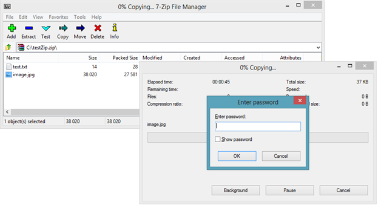

# ZipLibrary Overview

Have you ever wondered how to increase the responsiveness of your applications by compressing the data that you send over the internet? With the new __Zip Library__ you can compress data like images, docx or pdf files and send them over the wire. Thus, you will achieve fast andsecure transactions.

In order to use the __Zip Library__ in your application, you need to add a reference to the __Telerik.Windows.Zip.dll__ assembly. This is a cross-platform library that lets you load, create and update ZIP archives on the fly with easy to use API.

The assembly will be automatically added to the Bin folder when you create a Telerik Web Forms site or you can manually find it in the AdditionalLibraries folder in the Telerik UI for ASP.NET AJAX installation (automated and manual) and in the internal builds archive. It supports .NET 4 and .NET 4.5, so depending on the target framework of your project, you need to take the assembly from the Bin40 or Bin45 folder respectively.

For a full list of the Telerik assemblies you can refer to the[Included Assemblies](http://www.telerik.com/help/aspnet-ajax/introduction-included-assemblies.html) article.

## 

This is a list with short descriptions of the top-of-the-line features of Telerik's __Zip Library__ control:

* __Easy to use API__ – the __Zip Library__ exposes flexible and easy API to provide you with full control over the compressed data

* __Load or create ZIP files__ – you can load data from existing __ZIP__ files or create and edit __ZIPs__ that can be used by other applications. You can also create ZIP files in memory or add data to ZIP filefrom stream

* __Store your data in the Isolated Storage__ – you can store the compressed data in the Isolated Storage

* __Support for large files__ – the __Zip Library__ works seamlessly with large files
